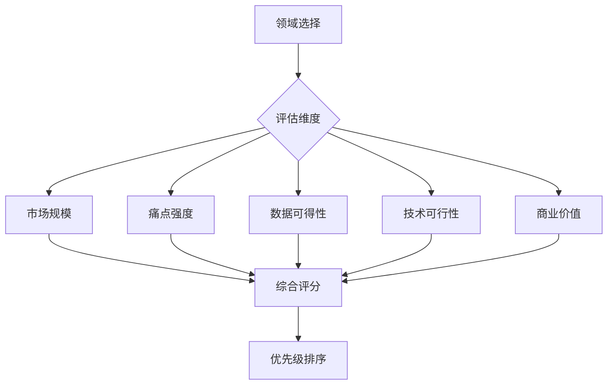

# Agent跨领域复制框架

## 核心概念

### 什么是Agent跨领域复制
指在一个垂直领域成功验证Agent应用后，将经验、方法论和技术架构复制到其他领域的过程。

### 复制价值
- **降低试错成本**：避免在新领域重复基础探索
- **加速落地**：从0到1的时间缩短60-80%
- **风险可控**：基于已验证的方法论降低失败率
- **规模效应**：形成可复制的商业模式

---

## 复制方法论

### 第一阶段：领域验证（Domain Validation）

#### 1.1 领域选择标准


**评估指标**：
- **市场规模**：TAM/SAM/SOM分析
- **痛点强度**：客户付费意愿
- **数据可得性**：训练数据获取难度
- **技术可行性**：现有技术成熟度
- **商业价值**：ROI预期

#### 1.2 最小可行验证（MVP）
- **验证目标**：核心功能可行性
- **验证周期**：2-4周
- **验证指标**：准确率、效率提升、用户满意度
- **成功标准**：达到预设KPI的80%

### 第二阶段：模式提炼（Pattern Extraction）

#### 2.1 核心模式识别
```python
# 模式提取框架
def extract_patterns(domain_success_cases):
    patterns = {
        'technical': {
            'architecture': '技术架构模式',
            'data_pipeline': '数据处理流程',
            'model_selection': '模型选择策略'
        },
        'business': {
            'value_proposition': '价值主张',
            'revenue_model': '盈利模式',
            'go_to_market': '市场进入策略'
        },
        'operational': {
            'deployment': '部署模式',
            'maintenance': '运维策略',
            'scaling': '扩展方案'
        }
    }
    return patterns
```

#### 2.2 可复用组件库
- **技术组件**：预训练模型、工具链、API接口
- **业务组件**：定价策略、销售话术、服务流程
- **运营组件**：培训材料、质量标准、监控体系

### 第三阶段：跨领域适配（Cross-Domain Adaptation）

#### 3.1 适配策略矩阵
| 适配维度 | 高度相似领域 | 中度相似领域 | 低度相似领域 |
|----------|--------------|--------------|--------------|
| **技术适配** | 微调参数 | 调整架构 | 重新设计 |
| **数据适配** | 数据增强 | 数据重构 | 数据重建 |
| **业务适配** | 价值微调 | 模式调整 | 策略重塑 |
| **时间成本** | 1-2个月 | 3-6个月 | 6-12个月 |

#### 3.2 适配优先级
1. **技术适配**（权重40%）：架构兼容性、数据格式、接口标准
2. **业务适配**（权重35%：价值主张、客户画像、竞争格局
3. **运营适配**（权重25%）：团队能力、流程体系、合规要求

---

## 实施路线图

### 第1个月：基础建设
- **Week 1-2**：建立跨领域复制方法论
- **Week 3-4**：开发适配评估工具

### 第2-3个月：试点复制
- **选择2-3个目标领域**
- **执行适配验证**
- **优化复制流程**

### 第4-6个月：规模化复制
- **建立复制工厂**
- **培训复制团队**
- **形成标准化流程**

---

## 成功要素

### 技术要素
1. **模块化架构**：高内聚、低耦合
2. **标准化接口**：统一API规范
3. **数据抽象层**：领域无关的数据处理
4. **配置驱动**：参数化而非硬编码

### 业务要素
1. **领域专家网络**：快速获取领域知识
2. **客户共创机制**：与早期客户深度合作
3. **生态系统**：合作伙伴网络
4. **持续学习**：反馈闭环机制

### 组织要素
1. **跨领域团队**：T型人才结构
2. **知识管理系统**：经验沉淀和复用
3. **激励机制**：鼓励知识分享
4. **质量文化**：标准化和持续改进

---

## 风险控制

### 技术风险
- **风险**：技术架构不适应新领域
- **应对**：提前技术调研，保留重构预算

### 业务风险
- **风险**：市场需求不匹配
- **应对**：MVP验证，小步快跑

### 运营风险
- **风险**：团队能力不足
- **应对**：培训和引进人才双管齐下

---

## 案例分析

### 成功案例：从客服到销售
**原始领域**：客服Agent
**复制领域**：销售Agent
**适配要点**：
- 技术：保留NLP核心，增强推荐算法
- 业务：从成本节约转向收入增长
- 运营：从服务标准转向销售流程

**成果**：复制周期缩短60%，ROI提升40%

### 失败案例：从医疗到金融
**教训**：
- 合规要求差异被低估
- 领域知识门槛过高
- 技术适配复杂度超出预期

---

## 最佳实践

### 1. 标准化评估体系
- 建立统一的领域评估框架
- 开发自动化评估工具
- 定期评估复制效果

### 2. 渐进式复制策略
- 从相似度高的领域开始
- 小范围试点验证
- 逐步扩大复制范围

### 3. 持续优化机制
- 建立反馈收集系统
- 定期回顾复制效果
- 持续改进方法论

---

## 关联知识

### 相关方法论
- [SaaS定价策略框架](../wiki/saas_pricing_strategy_framework.md)
- [AI咨询获客框架](../wiki/ai_consulting_client_acquisition_framework.md)

### 相关案例
- [IBM AI Agent案例](../raw/business_insider_ibm_ai_agent_saving_hours_20260412.md)

### 相关内容
- [AI咨询行业趋势分析](../outputs/ai_consulting_case_study_content_plan.md)

---

**创建时间**: 2026-04-17
**框架版本**: 1.0
**适用领域**: AI Agent商业化、跨领域复制、规模化扩张