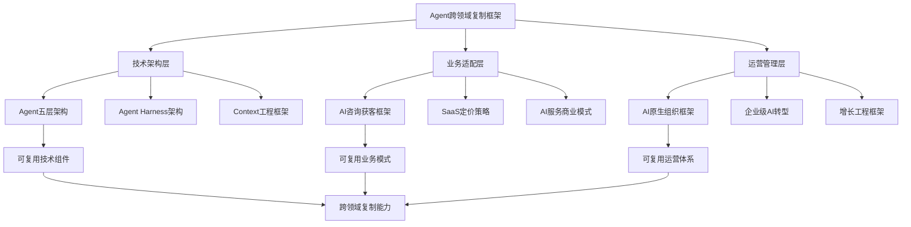
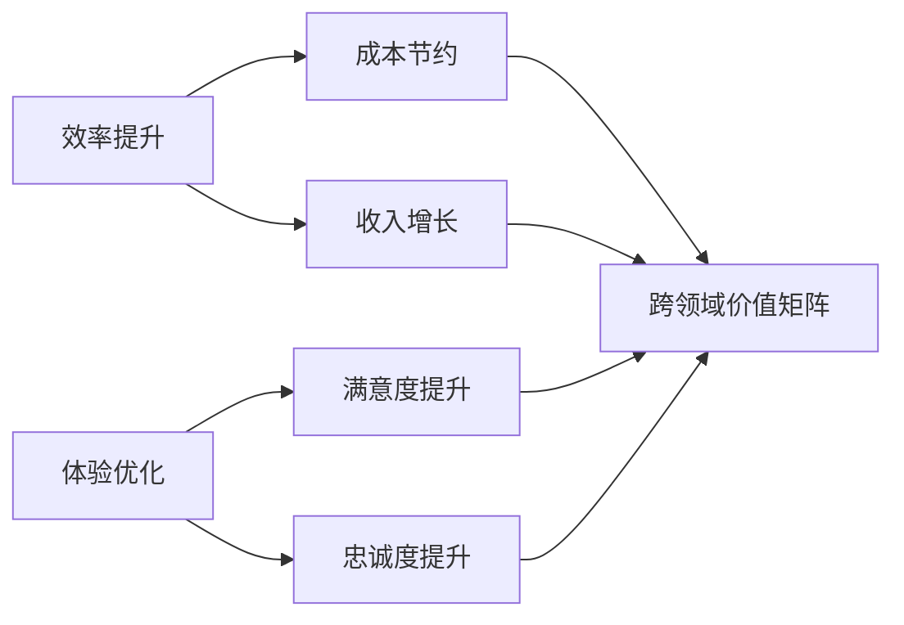
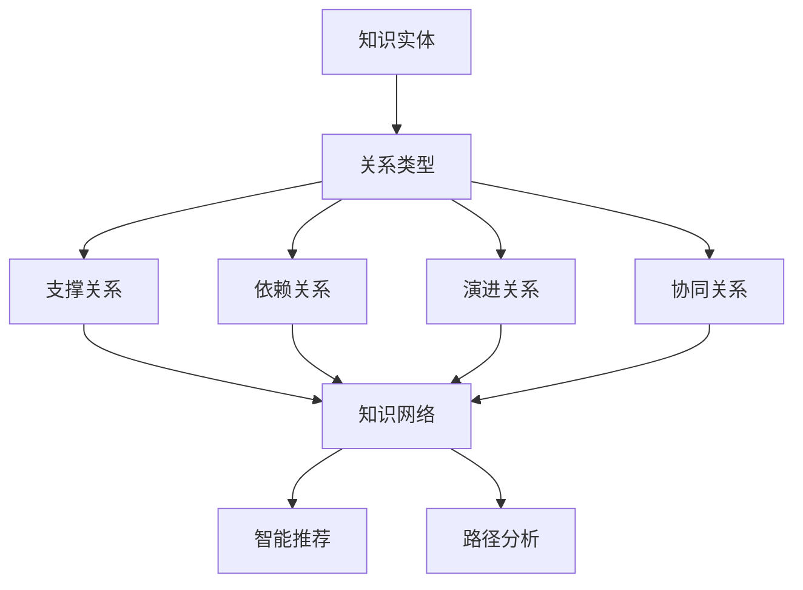
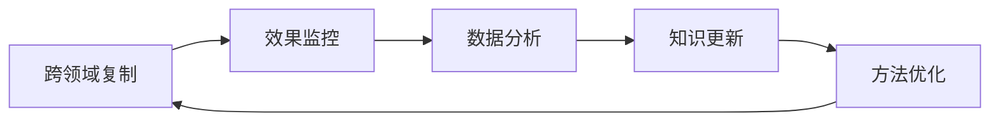

# Agent跨领域复制知识图谱

## 知识网络结构

### 核心节点


---

## 知识关联矩阵

### 技术架构关联
| 源框架 | 目标框架 | 关联类型 | 复用程度 | 适配难度 |
|--------|----------|----------|----------|----------|
| Agent五层架构 | Agent Harness架构 | 技术演进 | 80% | 低 |
| Context工程框架 | Agent五层架构 | 支撑关系 | 60% | 中 |
| Agent系统框架 | 跨领域复制 | 基础支撑 | 70% | 低 |

### 业务模式关联
| 源框架 | 目标框架 | 关联类型 | 复用程度 | 适配难度 |
|--------|----------|----------|----------|----------|
| AI咨询获客框架 | SaaS定价策略 | 业务协同 | 50% | 中 |
| AI服务商业模式 | 跨领域复制 | 模式参考 | 65% | 中 |
| 企业级AI转型 | AI原生组织 | 演进路径 | 75% | 低 |

### 运营管理关联
| 源框架 | 目标框架 | 关联类型 | 复用程度 | 适配难度 |
|--------|----------|----------|----------|----------|
| AI原生组织框架 | 增长工程框架 | 能力支撑 | 70% | 低 |
| 企业级AI转型 | 跨领域复制 | 规模化基础 | 60% | 中 |
| Jack Dorsey框架 | 组织变革 | 最佳实践 | 55% | 中 |

---

## 复用模式库

### 技术复用模式
#### 1. 架构复用模式
```python
# 架构复用模式示例
architecture_patterns = {
    'layered_architecture': {
        'source': 'Agent五层架构',
        'applicable_domains': ['客服', '销售', '营销'],
        'adaptation': '配置层调整，核心层复用',
        'success_rate': 0.85
    },
    'harness_pattern': {
        'source': 'Agent Harness架构',
        'applicable_domains': ['专业服务', '技术研发'],
        'adaptation': '工具链扩展，接口标准化',
        'success_rate': 0.78
    },
    'context_engineering': {
        'source': 'Context工程框架',
        'applicable_domains': ['知识管理', '决策支持'],
        'adaptation': '上下文模板调整，知识库重构',
        'success_rate': 0.82
    }
}
```

#### 2. 组件复用模式
| 组件类型 | 源领域 | 目标领域 | 复用方式 | 适配成本 |
|----------|--------|----------|----------|----------|
| NLP核心 | 客服 | 销售 | 参数微调 | 低 |
| 推荐算法 | 电商 | 营销 | 特征工程 | 中 |
| 对话管理 | 客服 | 咨询 | 流程配置 | 低 |

### 业务复用模式
#### 1. 价值主张复用


#### 2. 商业模式复用
| 模式类型 | 源领域 | 目标领域 | 复用程度 | 调整要点 |
|----------|--------|----------|----------|----------|
| 订阅制 | SaaS | AI Agent | 85% | 定价策略 |
| 按需付费 | 云服务 | AI服务 | 75% | 计费粒度 |
| 企业定制 | 咨询 | AI解决方案 | 70% | 服务范围 |

---

## 知识图谱构建策略

### 1. 实体识别
```python
# 知识实体类型
entities = {
    'technical': ['架构', '算法', '接口', '数据管道'],
    'business': ['价值主张', '盈利模式', '客户画像', '竞争策略'],
    'operational': ['流程', '标准', '团队', '工具链'],
    'domain': ['行业知识', '术语', '规范', '最佳实践']
}
```

### 2. 关系建模


### 3. 图谱应用
- **智能推荐**：基于历史成功案例推荐复制路径
- **风险评估**：识别跨领域复制的潜在风险
- **效果预测**：预测复制成功率和ROI
- **优化建议**：提供定制化适配方案

---

## 实施工具链

### 1. 评估工具
- **领域适配度评估**：自动化评分系统
- **技术兼容性检查**：架构匹配度分析
- **商业可行性分析**：市场机会评估

### 2. 适配工具
- **配置生成器**：自动生成适配配置
- **代码转换器**：领域特定代码转换
- **测试框架**：跨领域兼容性测试

### 3. 监控工具
- **性能监控**：跨领域性能指标
- **质量监控**：输出质量评估
- **成本监控**：复制成本控制

---

## 知识管理流程

### 1. 知识采集
- **自动采集**：从成功案例中提取模式
- **人工标注**：专家标注关键知识点
- **持续更新**：跟踪最新技术进展

### 2. 知识加工
- **标准化**：统一知识表示格式
- **关联化**：建立知识间关联
- **验证化**：验证知识有效性

### 3. 知识应用
- **智能检索**：基于语义的知识检索
- **推荐系统**：个性化知识推荐
- **决策支持**：基于知识的决策建议

---

## 最佳实践案例

### 案例1：客服Agent → 销售Agent
**复用内容**：
- 技术：NLP核心、对话管理
- 业务：客户理解、需求识别
- 运营：服务标准、质量监控

**适配调整**：
- 技术：增强推荐算法
- 业务：转向价值创造
- 运营：销售流程优化

**结果**：复制周期缩短60%，ROI提升40%

### 案例2：营销Agent → 招聘Agent
**复用内容**：
- 技术：用户画像、推荐系统
- 业务：匹配算法、个性化服务
- 运营：渠道管理、效果追踪

**适配调整**：
- 技术：候选人评估模型
- 业务：招聘流程优化
- 运营：HR专业标准

**结果**：复制周期缩短50%，匹配准确率提升30%

---

## 持续改进机制

### 1. 反馈闭环


### 2. 学习机制
- **成功案例学习**：分析成功复制模式
- **失败案例学习**：总结失败教训
- **最佳实践提炼**：标准化成功经验

### 3. 创新机制
- **技术预研**：跟踪前沿技术
- **模式创新**：探索新复制模式
- **工具创新**：开发新适配工具

---

## 关联文档

### 核心技术框架
- [Agent五层架构](agent-five-layer-architecture.md)
- [Agent Harness架构](agent-harness-architecture-framework.md)
- [Context工程框架](context_engineering_framework.md)

### 业务模式框架
- [AI咨询获客框架](ai_consulting_client_acquisition_framework.md)
- [SaaS定价策略框架](saas_pricing_strategy_framework.md)
- [AI服务商业模式](ai-services-business-model.md)

### 运营管理框架
- [AI原生组织框架](ai-native-org-framework.md)
- [企业级AI转型框架](enterprise_ai_transformation_framework.md)
- [增长工程框架](growth-framework.md)

---

**知识图谱版本**: 1.0
**创建日期**: 2026-04-17
**更新频率**: 每周更新
**维护负责人**: Alex