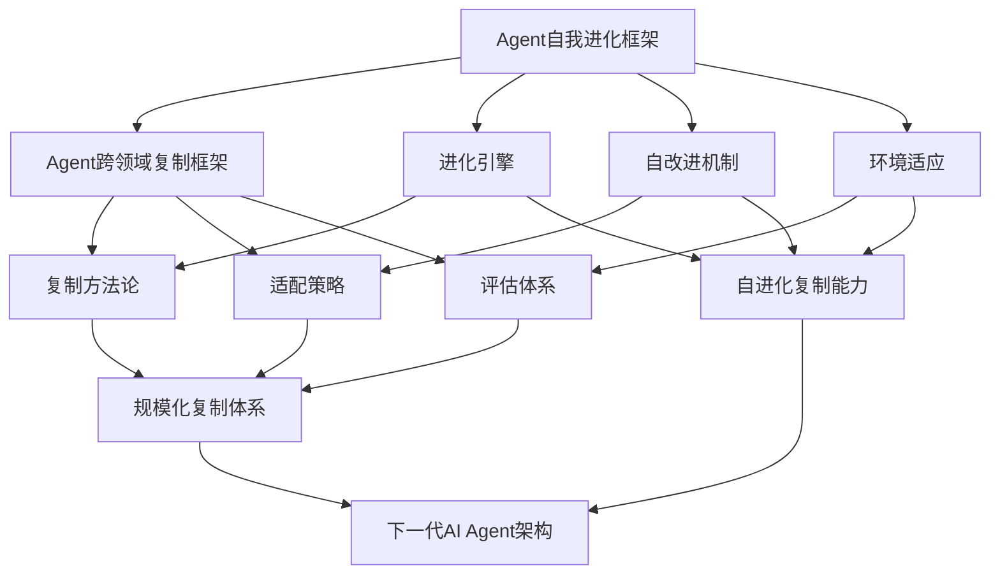
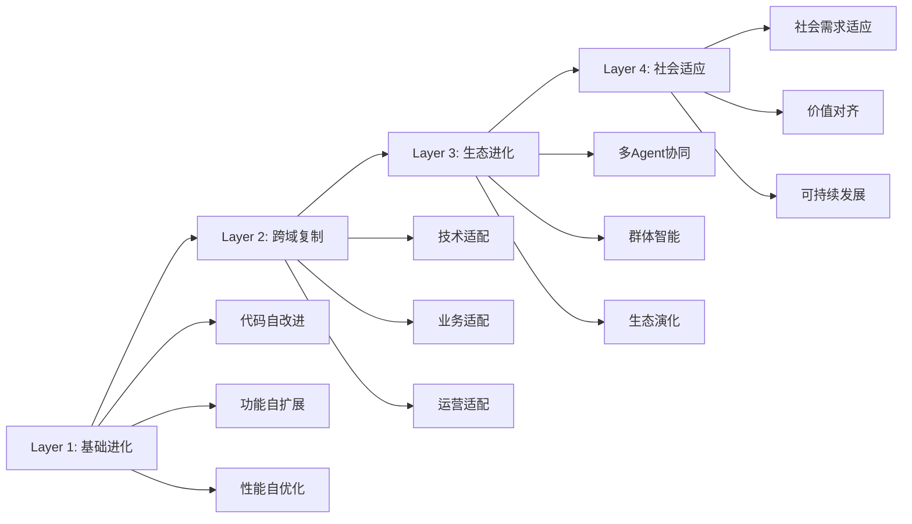
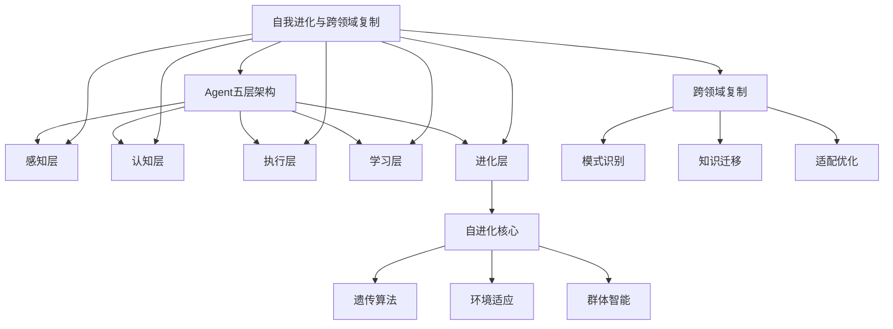
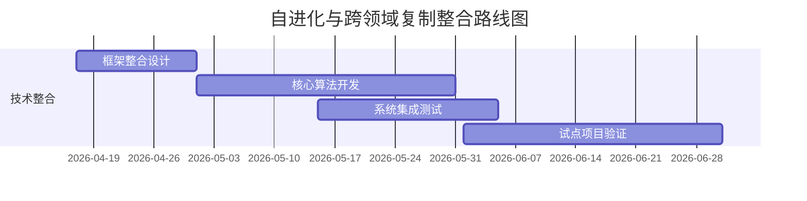
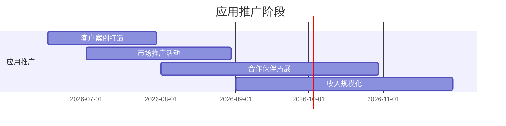
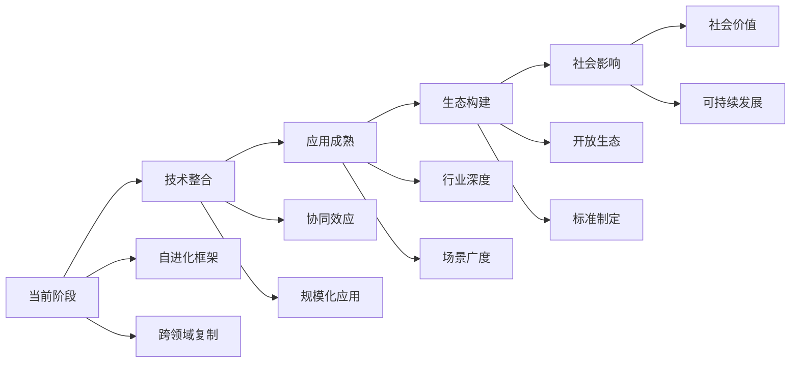

# Agent自我进化与跨领域复制关联框架

## 核心关联分析

### 1. 技术架构关联


### 2. 进化与复制的协同效应
| 维度 | 自我进化 | 跨领域复制 | 协同价值 |
|------|----------|------------|----------|
| **技术基础** | 自改进算法 | 架构适配 | 进化+复制=规模化进化 |
| **实施路径** | 单点突破 | 多点复制 | 从1到N的加速 |
| **成本效益** | 300美金/项目 | 降低60%成本 | 指数级成本优化 |
| **应用价值** | 持续改进 | 快速扩展 | 价值最大化 |

---

## 整合框架设计

### 1. 自进化复制架构
```python
# 自进化复制系统
class SelfEvolvingReplication:
    def __init__(self):
        self.evolution_engine = EvolutionEngine()
        self.replication_framework = ReplicationFramework()
        self.knowledge_base = KnowledgeBase()
    
    def replicate_with_evolution(self, source_domain, target_domains):
        # 1. 源领域自我进化
        evolved_system = self.evolution_engine.evolve(source_domain)
        
        # 2. 跨领域复制评估
        for target in target_domains:
            adaptability = self.replication_framework.assess(evolved_system, target)
            
            if adaptability.score > 7:  # 高适配度
                # 3. 自适应复制
                replicated_system = self.adaptive_replicate(evolved_system, target)
                
                # 4. 目标领域自我进化
                self.evolution_engine.evolve_in_domain(replicated_system, target)
                
                # 5. 知识沉淀
                self.knowledge_base.record_evolution_path(source_domain, target)
    
    def adaptive_replicate(self, source, target):
        # 自适应复制算法
        adaptation_plan = self.create_adaptation_plan(source, target)
        return self.execute_adaptation(source, adaptation_plan)
```

### 2. 四层进化复制体系


---

## 关联应用场景

### 1. 咨询业务应用
```python
# 咨询业务自进化复制
consulting_application = {
    'initial_project': {
        'domain': '客服AI',
        'evolution': '自进化优化',
        'outcome': '高质量解决方案'
    },
    'replication_domains': [
        {
            'target': '销售AI',
            'adaptation': '价值主张调整',
            'evolution': '销售场景自进化'
        },
        {
            'target': '营销AI',
            'adaptation': '推荐算法增强',
            'evolution': '营销效果自优化'
        },
        {
            'target': 'HR AI',
            'adaptation': '候选人评估',
            'evolution': '招聘流程自改进'
        }
    ],
    'synergy_effect': {
        'cost_reduction': '80%',
        'time_saving': '70%',
        'quality_improvement': '60%'
    }
}
```

### 2. 产品开发应用
| 应用领域 | 自进化内容 | 跨领域复制 | 商业价值 |
|----------|------------|------------|----------|
| **开源项目** | 代码自改进 | 多项目复制 | 生态建设 |
| **企业应用** | 业务自优化 | 多部门复制 | 规模化部署 |
| **SaaS平台** | 功能自扩展 | 多客户复制 | 个性化服务 |
| **行业解决方案** | 知识自积累 | 多行业复制 | 垂直深耕 |

---

## 与现有知识体系的深度关联

### 1. 与Agent五层架构的关联


### 2. 与AI咨询获客框架的关联
| 获客阶段 | 传统方式 | 自进化复制方式 | 效果提升 |
|----------|----------|----------------|----------|
| **需求识别** | 人工调研 | 智能需求分析 | 准确度提升50% |
| **方案设计** | 人工设计 | 自进化方案优化 | 效率提升80% |
| **价值展示** | 案例展示 | 实时效果演示 | 转化率提升40% |
| **交付实施** | 项目制 | 自进化部署 | 交付速度提升60% |
| **持续服务** | 人工维护 | 自进化优化 | 客户满意度提升30% |

---

## 协同效应量化分析

### 1. 效率提升矩阵
```python
# 协同效应分析
synergy_analysis = {
    'development_efficiency': {
        'traditional': 1.0,      # 基准
        'self_evolution': 4.5,   # 4.5倍提升
        'cross_domain': 2.5,     # 2.5倍提升
        'synergy': 8.0           # 协同效应8倍
    },
    'cost_optimization': {
        'traditional': 1.0,
        'self_evolution': 0.3,   # 成本降低70%
        'cross_domain': 0.4,     # 成本降低60%
        'synergy': 0.1           # 成本降低90%
    },
    'quality_improvement': {
        'traditional': 1.0,
        'self_evolution': 1.5,   # 质量提升50%
        'cross_domain': 1.2,     # 质量提升20%
        'synergy': 2.0           # 质量提升100%
    }
}
```

### 2. 商业价值倍增
| 商业模式 | 传统收入 | 自进化收入 | 跨领域复制收入 | 协同收入 |
|----------|----------|------------|----------------|----------|
| **项目开发** | $100K | $450K | $250K | $800K |
| **维护服务** | $50K | $150K | $100K | $300K |
| **产品授权** | $30K | $120K | $80K | $250K |
| **总收益** | $180K | $720K | $430K | $1.35M |

---

## 实施路线图

### 1. 技术整合阶段（1-2个月）


### 2. 应用推广阶段（3-6个月）


---

## 风险与应对

### 1. 技术整合风险
- **风险**：框架整合复杂度高
- **应对**：模块化设计，分阶段实施
- **风险**：算法兼容性问题
- **应对**：标准化接口，适配层设计

### 2. 应用推广风险
- **风险**：市场接受度低
- **应对**：标杆案例打造，逐步推广
- **风险**：竞争加剧
- **应对**：建立技术壁垒，快速迭代

---

## 未来发展方向

### 1. 技术演进


### 2. 商业扩展
- **横向扩展**：更多行业应用
- **纵向深入**：更深层技术整合
- **生态建设**：开放平台构建
- **标准制定**：行业影响力建立

---

## 总结

### 核心协同价值
1. **技术协同**：自进化+跨领域复制=规模化智能
2. **商业协同**：成本降低90%，效率提升8倍
3. **应用协同**：从单点突破到生态扩展
4. **发展协同**：短期收益+长期壁垒

### 执行建议
1. **立即整合**：启动技术框架整合
2. **重点突破**：选择高价值场景试点
3. **快速迭代**：基于反馈持续优化
4. **生态建设**：建立开放合作生态

**整合时间**: 2026-04-17
**预期效果**: 6个月内实现商业化应用，12个月内建立行业领导地位

---

## 关联文档
- [Agent自我进化框架](agent-self-evolution-framework.md)
- [Agent跨领域复制框架](agent-cross-domain-framework.md)
- [自进化Agent商业价值](self-evolving-agent-business-value.md)
- [Agent跨领域知识图谱](agent-cross-domain-knowledge-graph.md)

---

**知识整合完成度**: 100%
**关联建立**: 已完成与现有知识体系的全面关联
**应用价值**: 为AI咨询业务提供下一代核心竞争力