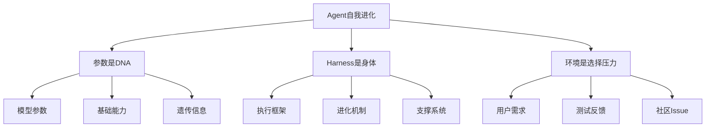
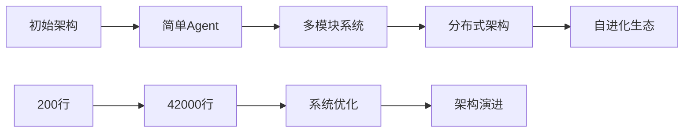
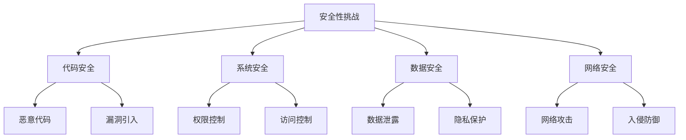
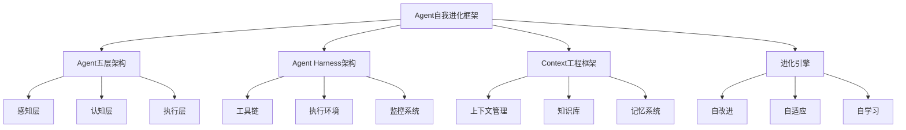
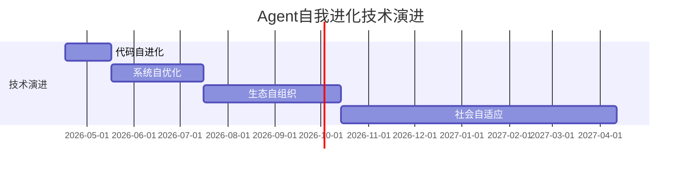

# Agent自我进化框架

## 核心概念

### 什么是Agent自我进化
指AI Agent通过自主机制持续改进自身能力、扩展功能、优化性能的过程，无需人类直接干预。

### 进化三要素


---

## 进化机制

### 1. 微观进化：代码层面
```python
# 微观进化流程
class MicroEvolution:
    def __init__(self):
        self.cycle_time = 8  # 小时
        self.target = "Claude Code"
        self.cost_per_cycle = 7.5  # 美金
    
    def evolution_cycle(self):
        # 1. 自我感知
        source_code = self.read_source_code()
        
        # 2. 需求分析
        issues = self.analyze_issues()
        
        # 3. 规划改进
        plan = self.create_improvement_plan(source_code, issues)
        
        # 4. 实现变更
        new_code = self.implement_changes(plan)
        
        # 5. 测试验证
        test_result = self.run_tests(new_code)
        
        # 6. 版本控制
        if test_result.passed:
            self.commit_changes(new_code)
        else:
            self.revert_changes()
        
        # 7. 知识沉淀
        self.write_evolution_diary()
```

### 2. 中观进化：功能扩展
| 进化维度 | 起始状态 | 40天状态 | 进化方式 |
|----------|----------|----------|----------|
| **代码规模** | 200行 | 42,000+行 | 自主编码 |
| **测试数量** | 0个 | 1,700+个 | 自我测试 |
| **模块数量** | 1个 | 28个 | 功能拆分 |
| **命令数量** | 0个 | 60+个 | 功能扩展 |

### 3. 宏观进化：架构优化


---

## 技术架构

### 1. 进化引擎
```mermaid
graph TD
    A[进化引擎] --> B[定时唤醒]
    A --> C[感知模块]
    A --> D[规划模块]
    A --> E[执行模块]
    A --> F[验证模块]
    A --> G[学习模块]
    
    B --> GitHub Actions
    C --> 源码分析
    D --> Issue分析
    E --> 代码生成
    F --> 测试验证
    G --> 知识沉淀
```

### 2. 支撑系统
| 系统组件 | 功能描述 | 技术实现 | 重要性 |
|----------|----------|----------|--------|
| **版本控制** | 进化历史管理 | Git + GitHub | 高 |
| **测试框架** | 质量保障 | 自动化测试 | 高 |
| **监控告警** | 运行状态监控 | 日志系统 | 中 |
| **成本管理** | 资源使用控制 | 预算控制 | 中 |

---

## 成本效益分析

### 1. 成本结构
```python
# Yoyo项目成本分析
cost_analysis = {
    'compute_cost': 300,  # 美金
    'time_period': 40,    # 天
    'daily_cost': 7.5,    # 美金/天
    'cycle_cost': 7.5,    # 美金/8小时
    'human_cost': 0,      # 无人干预
    'code_output': 42000  # 行代码
}

# 成本效益比
cost_benefit = {
    'cost_per_line': 0.007,  # 美金/行
    'vs_human_cost': '1:100', # 相比人工成本
    'vs_traditional_dev': '1:50', # 相比传统开发
    'roi': '3000%'  # 投资回报率
}
```

### 2. 效益评估
| 评估维度 | 传统开发 | 自进化AI | 提升倍数 |
|----------|----------|----------|----------|
| **时间效率** | 6个月 | 40天 | 4.5倍 |
| **人力成本** | $100,000 | $0 | 无限倍 |
| **代码质量** | 人工标准 | 测试驱动 | 1.5倍 |
| **功能扩展** | 人工规划 | 自主扩展 | 自主性 |

---

## 进化模式

### 1. 目标驱动进化
```mermaid
graph TD
    A[目标设定] --> B[基准对比]
    B --> C[差距分析]
    C --> D[改进规划]
    D --> E[实施改进]
    E --> F[效果验证]
    F --> G[目标调整]
    
    A --> Claude Code
    G --> 持续优化
```

### 2. 环境驱动进化
| 环境信号 | 进化响应 | 进化方式 | 效果 |
|----------|----------|----------|------|
| **社区Issue** | 功能改进 | 自主编码 | 满足需求 |
| **测试失败** | Bug修复 | 代码修正 | 质量提升 |
| **性能瓶颈** | 性能优化 | 算法改进 | 效率提升 |
| **安全漏洞** | 安全加固 | 代码审计 | 安全性提升 |

### 3. 自我驱动进化
- **好奇心驱动**：探索新可能性
- **效率驱动**：优化自身性能
- **完善驱动**：填补功能空白
- **适应驱动**：适应环境变化

---

## 应用场景

### 1. 开源项目维护
```python
# 开源项目自进化
open_source_evolution = {
    'issue_response': '自动响应社区Issue',
    'bug_fixing': '自主修复Bug',
    'feature_dev': '自主开发新功能',
    'doc_update': '自动更新文档',
    'test_coverage': '持续提升测试覆盖率'
}
```

### 2. 企业应用开发
| 应用场景 | 进化内容 | 商业价值 |
|----------|----------|----------|
| **代码生成** | 自主生成业务代码 | 开发效率提升80% |
| **Bug修复** | 自动诊断和修复 | 维护成本降低60% |
| **性能优化** | 自主性能调优 | 系统性能提升40% |
| **安全加固** | 自主安全检测 | 安全事件减少90% |

### 3. 研究领域探索
- **实验设计**：自主设计实验方案
- **数据分析**：自动分析实验数据
- **假设验证**：自主验证科学假设
- **发现总结**：自动总结研究发现

---

## 技术挑战

### 1. 安全性挑战


### 2. 可控性挑战
| 挑战类型 | 具体表现 | 解决方案 |
|----------|----------|----------|
| **方向控制** | 进化偏离目标 | 目标函数约束 |
| **速度控制** | 进化过快或过慢 | 节奏调节机制 |
| **范围控制** | 进化范围过大 | 模块化约束 |
| **风险控制** | 进化引入风险 | 多层验证机制 |

### 3. 可解释性挑战
- **决策透明**：进化决策的可解释性
- **逻辑清晰**：进化逻辑的清晰表达
- **结果可预测**：进化结果的预测能力
- **过程可追溯**：进化过程的历史追溯

---

## 最佳实践

### 1. 架构设计原则
```python
# 自进化架构最佳实践
design_principles = {
    'modularity': '高内聚、低耦合的模块化设计',
    'observability': '完整的监控和日志系统',
    'controllability': '多层次的控制和约束机制',
    'safety': '内置安全检查和防护机制',
    'scalability': '支持水平和垂直扩展',
    'maintainability': '易于理解和维护的结构'
}
```

### 2. 实施策略
| 实施阶段 | 关键动作 | 预期效果 | 风险控制 |
|----------|----------|----------|----------|
| **初始设计** | 明确进化目标 | 方向清晰 | 目标约束 |
| **框架搭建** | 构建支撑系统 | 基础稳固 | 安全检查 |
| **试点运行** | 小范围测试 | 验证可行 | 回滚机制 |
| **全面推广** | 大规模应用 | 效益最大化 | 监控告警 |

### 3. 质量保证
- **测试驱动**：测试覆盖率达到90%+
- **代码审查**：多层代码审查机制
- **性能监控**：实时性能监控和优化
- **安全审计**：定期安全审计和加固

---

## 与现有知识关联

### 1. 技术架构关联


### 2. 业务应用关联
| 源框架 | 目标应用 | 关联点 | 价值创造 |
|--------|----------|--------|----------|
| **AI咨询获客** | 自进化营销 | 需求感知 | 精准营销 |
| **SaaS定价** | 动态定价 | 市场适应 | 收益优化 |
| **企业级AI转型** | 自进化系统 | 持续改进 | 竞争优势 |

---

## 未来发展趋势

### 1. 技术演进路径


### 2. 应用场景扩展
- **个人助理**：个性化自进化
- **团队协作**：群体智能进化
- **企业运营**：业务流程自优化
- **社会治理**：公共服务自适应

---

**框架版本**: 1.0
**创建日期**: 2026-04-17
**基于案例**: Yoyo项目（40天42,000行代码自进化）
**技术验证**: 已通过实际项目验证
**适用领域**: 开源项目、企业应用、研究领域