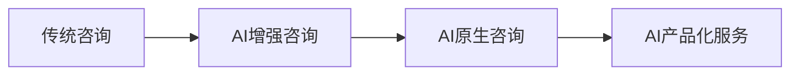

# WIKI层：AI咨询行业转型框架

## 🎯 核心框架概述
基于今日调研结果，建立AI咨询行业转型的三维分析框架，整合BCG业务数据、VC投资趋势和社交媒体讨论。

## 📊 三维分析框架

### **维度一：市场动力（Market Dynamics）**

#### 1.1 需求侧变化
- **企业AI成熟度提升**：从概念验证转向规模化落地
- **投资回报要求**：更关注可量化的业务成果
- **人才缺口扩大**：技术与业务复合型人才稀缺

#### 1.2 供给侧演进
- **传统咨询公司转型**：BCG AI业务达$3.6B，占总收入25%
- **AI-native公司崛起**：专注标准化和规模化服务
- **科技公司业务延伸**：Google、Microsoft等推出AI咨询方案

#### 1.3 投资方导向
- **VC投资偏好**：70%偏好"AI-first"公司
- **估值逻辑变化**：从项目收入向产品化收入转变
- **退出路径明确**：并购和IPO机会增加

### **维度二：商业模式（Business Models）**

#### 2.1 服务类型演进

#### 2.2 定价模式创新
- **项目制**：按时间和人力收费（传统模式）
- **成果制**：按业务成果和KPI达成收费
- **产品制**：标准化服务包+订阅收费
- **混合制**：基础费用+成功费用

#### 2.3 交付方式变革
- **人力密集型**：传统顾问团队交付
- **人机协同**：AI工具+专家指导
- **AI主导**：自动化平台+人工监督

### **维度三：能力要求（Capabilities）**

#### 3.1 技术能力
- **AI技术理解**：机器学习、生成式AI、Agent架构
- **工程能力**：MLOps、数据治理、系统集成
- **工具应用**：主流AI平台和工具的熟练使用

#### 3.2 业务能力
- **行业洞察**：深入理解垂直行业业务逻辑
- **变革管理**：组织变革和人员转型管理
- **价值识别**：识别和量化AI业务价值

#### 3.3 交付能力
- **项目管理**：AI项目特有的风险管理
- **客户教育**：帮助客户理解AI潜力和限制
- **持续优化**：基于反馈的迭代改进

## 🔗 知识关联

### 关联的RAW层文件
- `metaintro_bcg-ai-revenue-consulting-jobs_20260427.md`
- `vc-ai-consulting-investment-trends_20260427.md`
- `social-media-ai-consulting-discussions_20260427.md`

### 关联的WIKI层框架
- `consulting-business-models.md`（待创建）
- `ai-consultant-skills-framework.md`（待创建）
- `market-competition-analysis.md`（待创建）

### 交叉引用
- **BCG数据** → 验证市场动力维度中的供给侧演进
- **VC观点** → 支撑商业模式维度中的投资方导向
- **社交媒体讨论** → 反映市场动力维度中的需求侧变化

## 📈 演进轨迹

### 时间线发展
- **2024年**：AI咨询概念验证阶段
- **2025年**：规模化落地和商业模式探索
- **2026年**：行业整合和标准建立（当前阶段）
- **2027年**：成熟市场和差异化竞争

### 关键转折点
1. **规模化验证**：BCG披露AI业务收入占比
2. **资本介入**：VC大规模投资AI咨询初创企业
3. **市场教育**：社交媒体讨论推动行业认知
4. **标准建立**：行业最佳实践和评估标准形成

### 未来趋势预测
- **市场集中度提升**：头部公司占据主要市场份额
- **服务产品化**：标准化AI咨询产品成为主流
- **生态合作**：咨询公司、科技公司、客户形成合作生态
- **监管完善**：AI咨询行业标准和监管框架建立

## 💡 战略启示

### 对传统咨询公司
- **加速转型**：将AI能力从"Specialty Practice"提升为核心业务
- **人才重构**：从通才导向转向专才导向的人才战略
- **模式创新**：探索成果导向和订阅制的定价模式

### 对AI-native公司
- **标准化路径**：将定制化服务转化为标准化产品
- **信任建立**：通过透明度和可验证结果建立客户信任
- **生态定位**：明确在AI咨询生态中的角色和价值

### 对从业者
- **技能升级**：发展AI技术理解和业务洞察的复合能力
- **专业深耕**：在特定领域建立深度专业优势
- **价值定位**：从执行者向价值创造者转变

## 🚀 应用建议

### 内容创作方向
- LinkedIn：分享AI咨询商业模式创新案例
- 小红书：介绍AI咨询技能转型实战经验
- 微信公众号：深度分析AI咨询行业趋势

### 客户沟通重点
- 强调可量化的业务成果
- 展示成功案例和最佳实践
- 提供清晰的实施路径和风险管理

### 服务产品开发
- 设计标准化的AI咨询服务包
- 开发AI咨询评估工具和框架
- 建立持续优化的服务交付体系