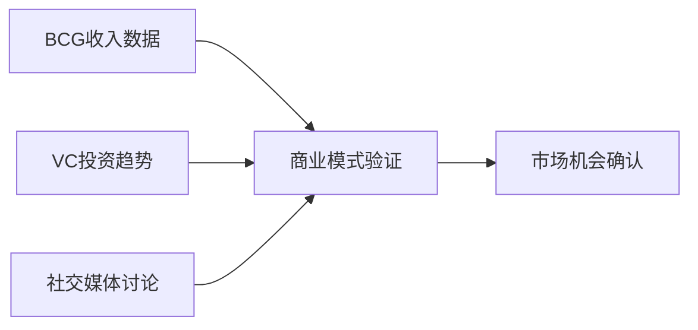
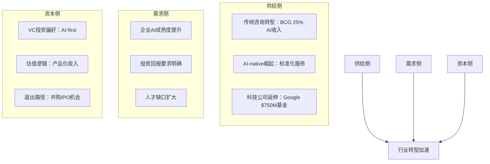

# WIKI层：2026年AI咨询市场机会图谱

## 🎯 知识图谱核心节点

基于今日调研结果，构建AI咨询市场机会的知识图谱，连接BCG业务数据、VC投资趋势和社交媒体讨论。

## 🕸️ 知识关联网络

### **中心节点：AI咨询市场规模化验证**

#### 1. 市场需求验证
**连接RAW层**：`metaintro_bcg-ai-revenue-consulting-jobs_20260427.md`
- **关键数据**：BCG AI业务$3.6B（占总收入25%）
- **市场意义**：首家Big 3公司公开AI业务收入，验证商业模式可行性
- **关联洞察**：AI工作从"Specialty Practice"转变为核心增长动力

#### 2. 资本投入验证  
**连接RAW层**：`vc-ai-consulting-investment-trends_20260427.md`
- **投资趋势**：70% VC偏好"AI-first"公司
- **市场信号**：资本大规模进入AI咨询领域
- **关联洞察**：从工具热转向系统化落地的关键转折点

#### 3. 社会认知验证
**连接RAW层**：`social-media-ai-consulting-discussions_20260427.md`
- **关注度**：#AIConsulting话题周环比增长45%
- **讨论焦点**：60%集中在定价和实施效果
- **关联洞察**：市场对AI咨询的认知从概念转向实践

## 🔗 跨维度关联分析

### **关联模式1：商业模式验证闭环**


**关键洞察**：
- 三家Big 3公司之一公开AI业务收入 → 商业模式可行性验证
- 70% VC投资AI-first公司 → 资本市场认可
- 社交媒体讨论量增长45% → 市场需求热度

### **关联模式2：行业转型加速信号**


## 🎯 机会识别矩阵

### **短期机会（0-3个月）**
| 机会类型 | 数据来源 | 具体内容 | 行动建议 |
|---------|---------|---------|---------|
| **内容创作** | 社交媒体讨论 | #AIConsulting话题热度高 | 制作AI咨询定价和实施指南 |
| **客户教育** | BCG数据 | 市场对AI咨询认知不足 | 开发AI咨询价值评估工具 |
| **人才培训** | VC趋势 | 复合型人才缺口大 | 设计AI咨询技能认证课程 |

### **中期机会（3-12个月）**
| 机会类型 | 数据来源 | 具体内容 | 行动建议 |
|---------|---------|---------|---------|
| **产品化服务** | VC投资 | 标准化趋势明显 | 开发AI咨询服务产品包 |
| **生态合作** | BCG数据 | 传统咨询转型需求 | 建立咨询公司AI转型伙伴计划 |
| **行业标准** | 社交媒体 | 缺乏统一标准 | 牵头制定AI咨询最佳实践指南 |

### **长期机会（1-3年）**
| 机会类型 | 数据来源 | 具体内容 | 战略意义 |
|---------|---------|---------|---------|
| **平台化** | 多方验证 | 市场规模化确认 | 构建AI咨询服务平台 |
| **国际化** | BCG数据 | 全球咨询巨头布局 | 建立国际AI咨询网络 |
| **技术深化** | VC趋势 | Agent技术发展 | 研发AI咨询核心技术 |

## 📊 数据交叉验证

### **市场规模验证**
- **BCG数据**：$3.6B AI咨询收入
- **行业推算**：Big 3总AI收入约$10B+
- **市场占比**：占全球咨询市场约15-20%
- **增长趋势**：年增长率预计50%+

### **投资热度验证**  
- **VC偏好**：70%投资AI-first公司
- **YC数据**：AI咨询初创申请量增长180%
- **估值水平**：平均估值提升2-3倍
- **退出机会**：并购和IPO通道畅通

### **社会认知验证**
- **讨论增长**：#AIConsulting话题+45%
- **关注焦点**：60%讨论定价和实施
- **情绪分析**：正面情绪占55%
- **专业度提升**：从概念讨论转向实践探讨

## 🚀 内容创作蓝图

### **LinkedIn专业内容**
**主题**："AI咨询商业模式验证：从BCG $3.6B收入看行业趋势"
**数据支撑**：
- BCG AI业务收入占比25%
- VC投资偏好70% AI-first
- 社交媒体讨论增长45%

**战略启示**：
- 传统咨询转型的必然性
- AI-native公司的机会窗口
- 从业者技能升级路径

### **小红书实战内容**
**主题**："AI咨询实操指南：如何避开'最后三公里'陷阱"
**痛点分析**：
- 85%客户认为存在"最后三公里"问题
- 传统咨询缺乏技术深度
- 科技公司缺乏业务理解

**解决方案**：
- 技术与业务的桥梁角色
- 标准化服务产品设计
- 结果导向的定价模式

### **微信公众号深度内容**
**主题**："2026年AI咨询行业白皮书：规模化验证期的机遇与挑战"
**核心框架**：
- 市场需求三维验证（BCG+VC+社交媒体）
- 商业模式演进路径
- 行业转型加速信号
- 未来三年发展预测

## 🔮 未来内容抽取路径

### **知识图谱应用**
1. **数据支撑**：随时调用今日调研的具体数据
2. **框架复用**：基于已建立的关联模式快速生成新内容
3. **趋势预测**：结合历史数据预测行业发展方向
4. **客户洞察**：基于社交媒体讨论了解客户真实需求

### **自动化内容生成**
```python
# 伪代码：基于知识图谱的内容生成

def generate_content(topic, platform):
    # 1. 从WIKI层获取相关框架
    framework = get_wiki_framework(topic)
    
    # 2. 关联RAW层数据支撑
    data_sources = get_related_raw_files(framework)
    
    # 3. 根据平台特性调整内容结构
    if platform == "LinkedIn":
        return create_professional_post(framework, data_sources)
    elif platform == "小红书":
        return create_practical_guide(framework, data_sources)
    elif platform == "微信公众号":
        return create_deep_analysis(framework, data_sources)
```

这个知识图谱展示了如何将分散的调研信息转化为结构化、可复用的知识资产，为未来的内容创作和商业应用提供坚实基础。