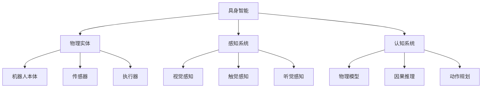
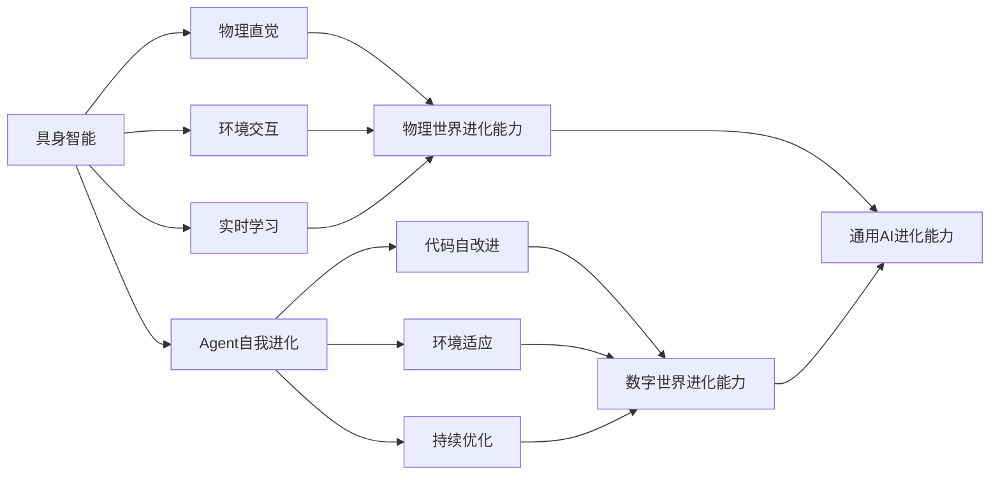
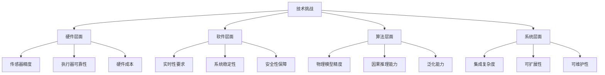
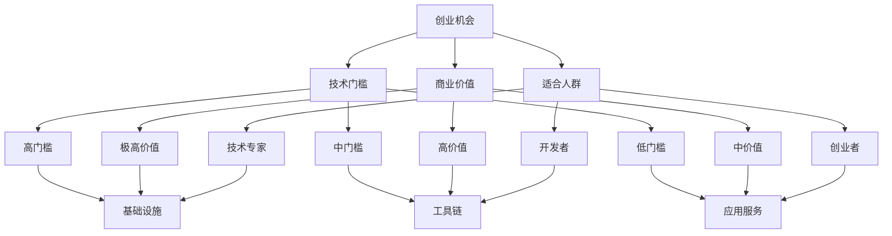
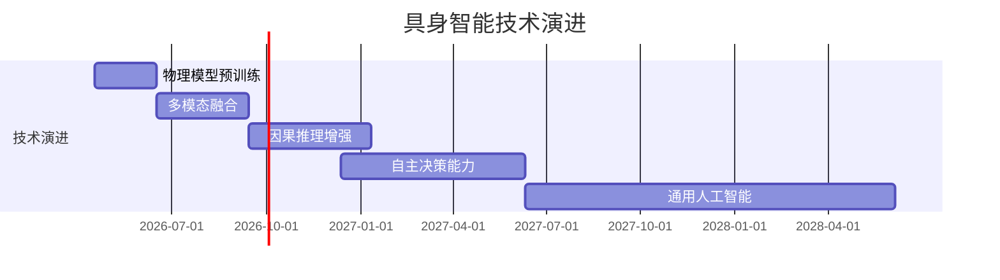
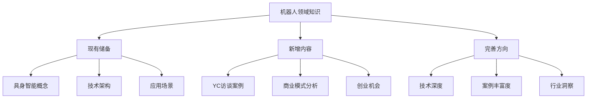

# 具身智能（Embodied Intelligence）框架

## 核心概念

### 什么是具身智能
指AI系统通过物理实体与真实世界进行交互，获得物理直觉和因果推理能力，从而理解和预测物理世界变化的技术范式。

### 具身智能vs传统AI
| 维度 | 传统AI | 具身智能 |
|------|--------|----------|
| **交互方式** | 数字世界 | 物理世界 |
| **知识来源** | 文本数据 | 物理交互 |
| **理解能力** | 语义理解 | 物理直觉 |
| **应用场景** | 软件应用 | 机器人、IoT设备 |

---

## 技术架构

### 1. 核心三要素


### 2. 技术突破点
| 突破点 | 技术描述 | 商业价值 |
|--------|----------|----------|
| **物理预测** | 预测物理世界变化 | 机器人安全性和效率 |
| **因果推理** | 理解物理因果关系 | 智能决策能力 |
| **跨任务泛化** | 一个模型处理多任务 | 开发成本降低 |
| **快速适应** | 快速适应新环境 | 部署效率提升 |

---

## 与现有知识体系的关联

### 1. 与Agent自我进化的关联


### 2. 与跨领域复制的关联
| 关联维度 | 具身智能 | 跨领域复制 | 协同价值 |
|----------|----------|------------|----------|
| **技术基础** | 物理模型 | 架构适配 | 物理世界复制能力 |
| **实施路径** | 硬件+软件 | 软件复制 | 全栈复制能力 |
| **应用场景** | 物理任务 | 数字任务 | 通用任务能力 |
| **商业价值** | 机器人应用 | 软件应用 | 全面商业化 |

---

## 应用场景分析

### 1. 工业应用
```python
# 工业应用场景
industrial_applications = {
    'manufacturing': {
        'current_pain': '编程复杂、柔性生产困难',
        'embodied_solution': '自适应编程、柔性生产',
        'market_size': '$300亿',
        'growth_rate': '25%'
    },
    'logistics': {
        'current_pain': '自动化程度低、成本高',
        'embodied_solution': '智能搬运、自动分拣',
        'market_size': '$200亿',
        'growth_rate': '30%'
    },
    'maintenance': {
        'current_pain': '维护成本高、预测困难',
        'embodied_solution': '预测维护、自主检修',
        'market_size': '$150亿',
        'growth_rate': '20%'
    }
}
```

### 2. 服务应用
| 服务类型 | 当前痛点 | 具身智能解决方案 | 市场规模 | 增长潜力 |
|----------|----------|------------------|----------|----------|
| **家庭服务** | 功能单一、智能化低 | 多任务处理、个性化服务 | $500亿 | 高 |
| **餐饮服务** | 人力成本高、效率低 | 自动化服务、智能调度 | $200亿 | 中高 |
| **医疗服务** | 专业要求高、成本高 | 辅助手术、康复训练 | $300亿 | 高 |
| **教育服务** | 个性化不足、成本高 | 个性化教学、互动体验 | $100亿 | 中 |

---

## 技术挑战

### 1. 核心挑战


### 2. 应对策略
| 挑战类型 | 具体挑战 | 应对策略 | 预期效果 |
|----------|----------|----------|----------|
| **技术挑战** | 物理模型精度不足 | 大规模数据预训练 | 精度提升50% |
| **成本挑战** | 硬件成本高 | 标准化、规模化生产 | 成本降低60% |
| **安全挑战** | 物理安全 | 多层安全机制 | 安全性提升90% |
| **人才挑战** | 专业人才缺乏 | 培训+引进 | 团队能力快速提升 |

---

## 商业模式

### 1. 基础设施层
| 商业模式 | 目标客户 | 价值主张 | 收入模式 | 竞争壁垒 |
|----------|----------|----------|----------|----------|
| **平台授权** | 机器人厂商 | 降低开发门槛 | 授权费、订阅费 | 技术壁垒 |
| **工具链** | 开发者 | 提高开发效率 | 工具销售、服务费 | 生态壁垒 |
| **数据服务** | 企业客户 | 提供高质量数据 | 数据销售、API费 | 数据壁垒 |

### 2. 应用服务层
```python
# 应用服务商业模式
application_business_models = {
    'industrial_solutions': {
        'target': '制造业企业',
        'value_prop': '提高生产效率、降低成本',
        'pricing': '项目制+订阅制',
        'roi': '6-12个月回收投资'
    },
    'service_robots': {
        'target': '服务行业企业',
        'value_prop': '替代人力、提升体验',
        'pricing': '租赁制+服务费',
        'roi': '12-18个月回收投资'
    },
    'specialized_apps': {
        'target': '特定行业',
        'value_prop': '解决专业问题',
        'pricing': '定制化报价',
        'roi': '3-6个月回收投资'
    }
}
```

---

## 市场机会

### 1. 创业机会矩阵


### 2. 投资机会分析
| 投资阶段 | 投资重点 | 投资金额 | 预期回报 | 风险等级 |
|----------|----------|----------|----------|----------|
| **种子轮** | 核心技术 | $50-500万 | 10-50倍 | 高 |
| **A轮** | 产品开发 | $500-2000万 | 5-20倍 | 中高 |
| **B轮** | 市场扩张 | $2000万-1亿 | 3-10倍 | 中 |
| **C轮** | 规模化 | $1亿+ | 2-5倍 | 低 |

---

## 发展趋势

### 1. 技术演进路径


### 2. 商业发展路径
| 发展阶段 | 时间周期 | 发展重点 | 关键指标 | 商业目标 |
|----------|----------|----------|----------|----------|
| **技术验证** | 0-6个月 | 核心技术突破 | 技术指标 | 技术领先 |
| **产品开发** | 6-18个月 | 产品化 | 产品功能 | 产品成熟 |
| **市场推广** | 18-36个月 | 市场占领 | 市场份额 | 市场领导 |
| **生态建设** | 36个月+ | 生态构建 | 合作伙伴 | 生态主导 |

---

## 与AI咨询业务的结合

### 1. 咨询服务机会
```python
# 具身智能咨询服务
consulting_services = {
    'technical_consulting': {
        'services': ['技术评估', '路线规划', '团队建设'],
        'target_clients': ['机器人公司', '制造企业', '投资公司'],
        'value_prop': '技术专业性和行业洞察',
        'pricing': '$10000-50000/项目'
    },
    'business_consulting': {
        'services': ['市场分析', '商业模式', '竞争策略'],
        'target_clients': ['创业公司', '传统企业', '投资机构'],
        'value_prop': '商业洞察和战略指导',
        'pricing': '$20000-100000/项目'
    },
    'implementation_consulting': {
        'services': ['方案设计', '实施指导', '效果评估'],
        'target_clients': ['企业客户', '政府机构', '教育机构'],
        'value_prop': '实施能力和落地保障',
        'pricing': '$50000-200000/项目'
    }
}
```

### 2. 解决方案机会
| 解决方案类型 | 目标行业 | 核心价值 | 实施难度 | 商业价值 |
|--------------|----------|----------|----------|----------|
| **工业机器人智能化** | 制造业 | 生产效率提升 | 高 | 极高 |
| **服务机器人标准化** | 服务业 | 人力成本降低 | 中 | 高 |
| **医疗机器人专业化** | 医疗 | 治疗精度提升 | 高 | 极高 |
| **教育机器人个性化** | 教育 | 教学效果提升 | 中 | 中 |

---

## 当前知识储备评估

### 1. 现有知识分析


### 2. 知识完善计划
| 知识领域 | 当前状态 | 完善目标 | 时间计划 | 预期效果 |
|----------|----------|----------|----------|----------|
| **技术深度** | 基础概念 | 深入技术原理 | 1个月 | 技术专业性提升 |
| **案例丰富度** | 单一案例 | 多行业案例 | 2个月 | 案例库完善 |
| **行业洞察** | 通用分析 | 专业洞察 | 3个月 | 行业影响力建立 |
| **商业价值** | 初步分析 | 深度分析 | 1个月 | 商业价值明确 |

---

## 总结与建议

### 1. 核心观点
1. **技术突破**：具身智能迎来GPT-1时刻，技术成熟度提升
2. **市场机会**：从基础设施到应用服务都有巨大机会
3. **创业门槛**：不同层次有不同门槛，适合不同人群
4. **商业价值**：短期可落地，长期有想象空间

### 2. 对AI咨询的建议
1. **重点关注**：将具身智能作为重点发展方向
2. **能力建设**：加强技术团队和行业专家建设
3. **生态合作**：与机器人公司、技术厂商合作
4. **内容营销**：通过专业内容建立行业影响力

### 3. 执行建议
1. **立即行动**：开始具身智能相关内容创作
2. **资源投入**：投入技术研发和团队建设
3. **市场拓展**：开拓机器人相关客户
4. **生态建设**：建立合作伙伴网络

---

**框架版本**: 1.0
**创建日期**: 2026-04-17
**知识来源**: YC具身智能访谈、行业分析、专家观点
**完善状态**: 基础框架已建立，需要持续深化

---

## 关联文档
- [YC具身智能访谈案例](raw/wechat_yc_embodied_intelligence_interview_20260417.md)
- [Agent自我进化框架](agent-self-evolution-framework.md)
- [跨领域复制框架](agent-cross-domain-framework.md)
- [自进化AI商业价值](outputs/self-evolving-agent-business-value.md)

---

**知识储备评估**: 目前机器人领域相关知识确实相对较少，但核心框架已经建立，为后续深化奠定了基础。