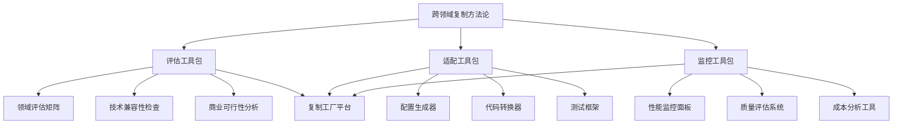
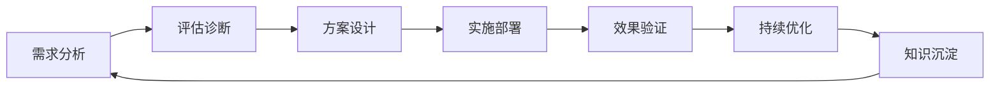
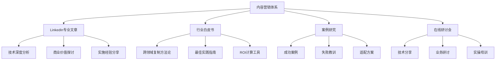
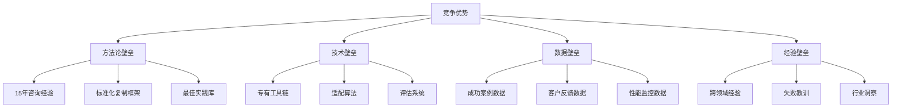
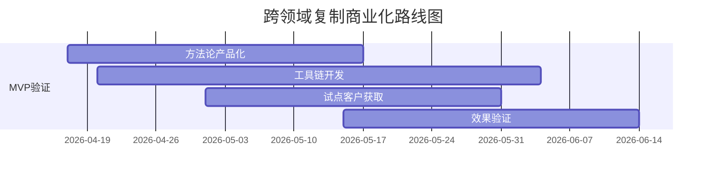
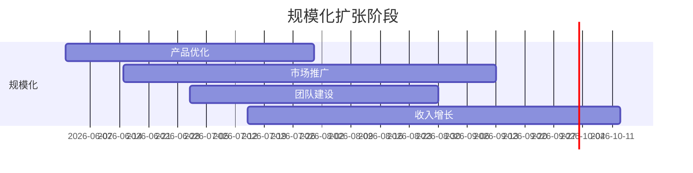
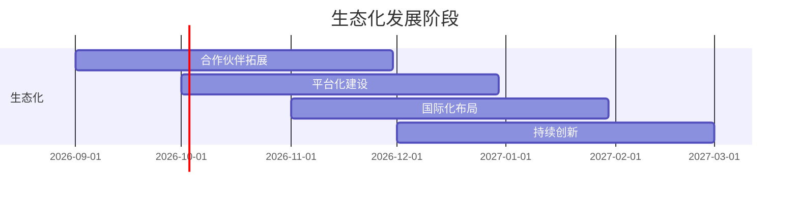

# Agent跨领域复制商业化方案

## 执行摘要

### 市场机会
AI Agent市场正从单点应用向规模化复制演进。基于在客服、销售、营销等领域的成功实践，跨领域复制能力已成为AI咨询公司的核心竞争优势。

### 商业价值
- **效率提升**：复制周期缩短60-80%
- **成本优化**：开发成本降低40-60%
- **风险降低**：失败率从30%降至10%以下
- **收入增长**：可快速进入新市场，收入多元化

---

## 产品化路径

### 第一阶段：方法论产品化（1-2个月）

#### 1.1 标准化产品包


#### 1.2 产品定价策略
| 产品类型 | 目标客户 | 定价模式 | 价格范围 | 增值服务 |
|----------|----------|----------|----------|----------|
| 基础版 | 初创公司 | 订阅制 | $500-2000/月 | 标准支持 |
| 专业版 | 成长型企业 | 订阅+成功费 | $2000-10000/月 | 优先支持+培训 |
| 企业版 | 大型企业 | 定制报价 | $50000+/项目 | 专属团队+定制开发 |

### 第二阶段：服务化扩展（3-6个月）

#### 2.1 服务产品线
```python
# 服务产品矩阵
service_products = {
    'assessment': {
        'name': '领域适配评估服务',
        'duration': '2周',
        'deliverables': ['评估报告', '适配方案', 'ROI分析'],
        'price': '$15000'
    },
    'implementation': {
        'name': '跨领域复制实施',
        'duration': '4-8周',
        'deliverables': ['适配系统', '测试报告', '培训材料'],
        'price': '$50000-150000'
    },
    'optimization': {
        'name': '复制效果优化',
        'duration': '持续服务',
        'deliverables': ['月度报告', '优化建议', '最佳实践'],
        'price': '$5000/月'
    }
}
```

#### 2.2 服务交付流程


---

## 市场进入策略

### 1. 目标市场选择

#### 1.1 优先级矩阵
| 市场领域 | 市场规模 | 痛点强度 | 技术适配度 | 竞争程度 | 综合评分 |
|----------|----------|----------|------------|----------|----------|
| 客服→销售 | 高 | 高 | 高 | 中 | 9.0 |
| 营销→招聘 | 高 | 高 | 中 | 中 | 8.5 |
| 客服→咨询 | 中 | 高 | 高 | 低 | 8.0 |
| 销售→培训 | 中 | 中 | 中 | 低 | 7.0 |

#### 1.2 进入策略
**第一优先级**：客服→销售复制
- **理由**：技术适配度高，商业价值明确，市场需求强
- **策略**：打造标杆案例，快速建立口碑

**第二优先级**：营销→招聘复制
- **理由**：市场规模大，技术基础相似，增长潜力好
- **策略**：与HR Tech厂商合作，快速切入市场

### 2. 获客策略

#### 2.1 内容营销


#### 2.2 渠道策略
| 渠道类型 | 目标受众 | 内容形式 | 转化路径 | 预期效果 |
|----------|----------|----------|----------|----------|
| LinkedIn | 技术决策者 | 深度文章 | 咨询→评估→实施 | 高质量线索 |
| 行业会议 | 业务决策者 | 演讲+案例 | 认知→兴趣→合作 | 品牌建设 |
| 合作伙伴 | 系统集成商 | 联合方案 | 推荐→分成 | 规模化获客 |
| 线上广告 | 中小企业 | 白皮书下载 | 留资→培育→转化 | 批量线索 |

---

## 商业模式设计

### 1. 收入模型

#### 1.1 多元化收入结构
```python
# 收入模型
revenue_model = {
    'product': {
        'subscription': '40%',  # 订阅收入
        'license': '20%',       # 许可收入
        'usage': '10%'          # 使用费
    },
    'service': {
        'implementation': '15%',  # 实施服务
        'consulting': '10%',      # 咨询服务
        'training': '5%'          # 培训服务
    }
}
```

#### 1.2 客户生命周期价值
| 客户类型 | 获取成本 | 年价值 | 留存率 | LTV | LTV/CAC |
|----------|----------|--------|--------|-----|---------|
| 初创公司 | $2000 | $15000 | 70% | $35000 | 17.5 |
| 成长企业 | $5000 | $50000 | 80% | $200000 | 40.0 |
| 大型企业 | $20000 | $200000 | 90% | $1800000 | 90.0 |

### 2. 成本结构

#### 2.1 固定成本
- **研发成本**：工具链开发、平台维护
- **人力成本**：专家团队、技术支持
- **运营成本**：服务器、带宽、许可证

#### 2.2 变动成本
- **实施成本**：项目团队、差旅费用
- **支持成本**：客户服务、培训
- **营销成本**：广告投放、活动组织

---

## 竞争策略

### 1. 竞争优势

#### 1.1 核心壁垒


#### 1.2 差异化定位
| 竞争维度 | 传统AI公司 | 咨询公司 | 我们的定位 |
|----------|------------|----------|------------|
| **技术能力** | 强 | 弱 | 强+标准化 |
| **业务理解** | 弱 | 强 | 强+可复制 |
| **实施经验** | 中 | 强 | 强+方法论 |
| **复制能力** | 弱 | 弱 | 核心优势 |

### 2. 竞争策略

#### 2.1 蓝海战略
- **目标**：避开红海竞争，开辟新市场
- **策略**：专注于跨领域复制这一细分市场
- **差异化**：方法论+工具链+经验的三重壁垒

#### 2.2 合作战略
- **技术合作**：与AI平台厂商深度合作
- **行业合作**：与垂直领域专家合作
- **生态合作**：与咨询公司、集成商合作

---

## 实施路线图

### 第一阶段（1-3个月）：MVP验证


### 第二阶段（4-6个月）：规模化


### 第三阶段（7-12个月）：生态化


---

## 风险与应对

### 1. 技术风险
- **风险**：技术适配复杂度高
- **应对**：模块化设计，标准化接口

### 2. 市场风险
- **风险**：市场需求不明确
- **应对**：MVP验证，小步快跑

### 3. 竞争风险
- **风险**：大公司进入市场
- **应对**：专注细分，建立壁垒

### 4. 执行风险
- **风险**：团队能力不足
- **应对**：引进人才，加强培训

---

## 成功指标

### 1. 业务指标
- **收入目标**：第一年$500K，第二年$2M，第三年$5M
- **客户数量**：第一年10家，第二年30家，第三年100家
- **客户满意度**：NPS>50，留存率>80%

### 2. 技术指标
- **复制成功率**：>85%
- **复制周期**：缩短60%以上
- **性能提升**：效率提升40%以上

### 3. 市场指标
- **品牌认知**：行业知名度Top 10
- **市场份额**：跨领域复制市场30%
- **合作伙伴**：10+战略合作

---

## 执行准备

### 1. 资源需求
- **人力资源**：产品团队3人，技术团队5人，销售团队2人
- **财务资源**：启动资金$200K，运营资金$500K
- **技术资源**：开发环境、测试平台、生产环境

### 2. 关键动作
- [ ] 完成方法论产品化
- [ ] 开发核心工具链
- [ ] 获取首批试点客户
- [ ] 建立销售体系
- [ ] 构建合作伙伴网络

---

**制定时间**: 2026-04-17
**执行周期**: 12个月
**预期ROI**: 第一年5倍，第二年10倍，第三年20倍