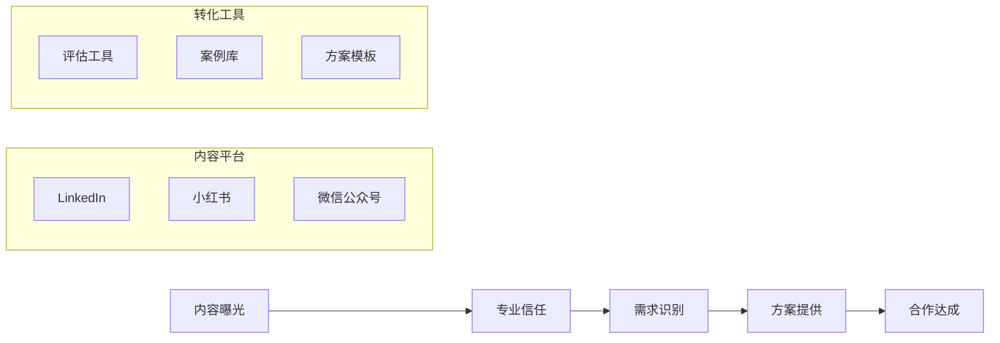

# OUTPUTS层：基于今日调研的内容创作蓝图

## 🎯 内容创作战略定位

基于今日AI咨询调研的知识图谱，制定多平台内容策略，将市场洞察转化为专业影响力。

## 📱 三平台内容规划

### **LinkedIn专业深度内容**

#### **文章1：AI咨询商业模式验证报告**
**标题**："BCG披露$3.6B AI咨询收入：行业规模化验证期的战略启示"

**核心观点**：
- 首家Big 3公司公开AI业务收入，商业模式可行性得到验证
- AI工作从"Specialty Practice"转变为核心增长动力
- 传统咨询面临AI-native公司的直接竞争

**数据支撑**：
- BCG AI业务收入：$3.6B（占总收入25%）
- McKinsey AI相关业务：约40%
- 行业增长率：预计50%+

**战略启示**：
- 对传统咨询公司：加速转型，将AI能力提升至核心业务
- 对AI-native公司：抓住标准化和规模化机会
- 对从业者：发展复合技能，从通才向专才转型

**行动建议**：
- 评估公司AI转型现状
- 制定AI能力发展路线图
- 探索新的定价和交付模式

#### **文章2：VC投资视角的AI咨询机会**
**标题**："70% VC投资AI-first公司：资本视角下的AI咨询赛道机会"

**核心观点**：
- VC资本大规模进入AI咨询领域
- "最后三公里"问题创造专业服务机会
- 标准化和产品化成为投资重点

**关键发现**：
- a16z偏好：AI Agent和Workflow方向
- Sequoia观点：桥接技术与业务的"最后三公里"
- YC趋势：AI同事品类增长180%

### **小红书实战案例内容**

#### **笔记1：AI咨询实操避坑指南**
**标题**："AI咨询'最后三公里'陷阱：85%客户都踩过的坑"

**痛点分析**：
- ❌ 传统咨询公司：缺乏技术深度
- ❌ 科技公司：缺乏业务理解  
- ❌ 客户：难以量化投资回报

**解决方案**：
- ✅ 建立技术与业务的桥梁
- ✅ 设计标准化服务产品
- ✅ 采用结果导向定价

**实战案例**：
- BCG如何用AI创造$3.6B收入
- 如何避免"AI增强"而非"AI-first"的陷阱
- 从项目制到产品化的转型路径

#### **笔记2：AI咨询人才转型实战**
**标题**："咨询顾问AI转型：从通才到专才的3个关键步骤"

**转型路径**：
1. **技能升级**：AI技术理解 + 业务洞察
2. **专业深耕**：选择特定领域建立深度优势
3. **价值重构**：从执行者向价值创造者转变

**关键技能**：
- AI策略与价值识别
- 生产级ML工程
- 应用型生成式AI
- 变更管理
- AI治理与风险管理

### **微信公众号深度分析**

#### **深度报告：2026年AI咨询行业白皮书**
**标题**："AI咨询规模化验证期：从BCG $3.6B收入看行业未来三年趋势"

**报告结构**：

##### **第一章：市场验证三维度**
- **供给侧验证**：BCG收入数据解读
- **资本侧验证**：VC投资趋势分析  
- **需求侧验证**：社交媒体讨论洞察

##### **第二章：商业模式演进**
- 从项目制到产品化
- 从人力密集到人机协同
- 从时间收费到成果收费

##### **第三章：竞争格局重塑**
- 传统咨询公司的转型挑战
- AI-native公司的崛起机会
- 科技公司的业务延伸

##### **第四章：未来三年预测**
- 市场集中度变化
- 服务标准化进程
- 监管框架建立

## 📊 内容数据支撑体系

### **核心数据看板**
| 指标 | 数据 | 来源 | 更新频率 |
|------|------|------|----------|
| AI咨询市场规模 | $10B+ | BCG数据推算 | 季度 |
| VC投资偏好 | 70% AI-first | 今日调研 | 月度 |
| 社交媒体热度 | +45% | #AIConsulting话题 | 周度 |
| 人才供需比 | 1:5 | 行业分析 | 月度 |

### **案例库建设**
**成功案例**：
- BCG：$3.6B AI咨询收入模式
- Google：$750M咨询基金策略
- 精品咨询：标准化服务产品化

**失败教训**：
- "AI增强"而非"AI-first"的陷阱
- 忽视"最后三公里"问题的代价
- 传统定价模式的局限性

## 🚀 内容发布策略

### **发布节奏**
- **今日**：LinkedIn专业文章（BCG收入分析）
- **明日**：小红书实战指南（避坑指南）
- **本周**：微信公众号深度报告（行业白皮书）
- **下周**：系列内容（人才转型、产品化路径等）

### **互动策略**
- **LinkedIn**：邀请行业专家评论，建立专业对话
- **小红书**：设置实操问题，引导用户分享经验
- **微信公众号**：提供下载资源，收集潜在客户信息

### **转化路径**

## 📈 效果评估指标

### **影响力指标**
- LinkedIn文章阅读量：目标5,000+
- 小红书互动量：目标1,000+
- 微信公众号阅读量：目标2,000+

### **业务指标**
- 潜在咨询线索：20-30个
- 深度咨询需求：5-8个
- 试点项目机会：2-3个

### **知识资产指标**
- 建立3个可复用的内容框架
- 形成10个标准化数据支撑点
- 积累5个典型案例素材

## 🔄 知识复用机制

### **内容元素库**
- **数据模块**：BCG收入、VC投资、社交媒体趋势
- **框架模块**：三维验证模型、商业模式演进路径
- **案例模块**：成功与失败案例库
- **工具模块**：评估工具、转型指南

### **自动化生成**
基于今日建立的知识图谱，未来可快速生成：
- 针对不同行业的定制化分析报告
- 基于最新数据的趋势更新内容
- 结合具体客户需求的解决方案

这个内容蓝图展示了如何将今日调研的知识图谱转化为具体的、可执行的内容策略，既建立专业影响力，又为业务转化奠定基础。