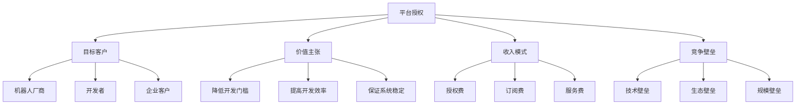
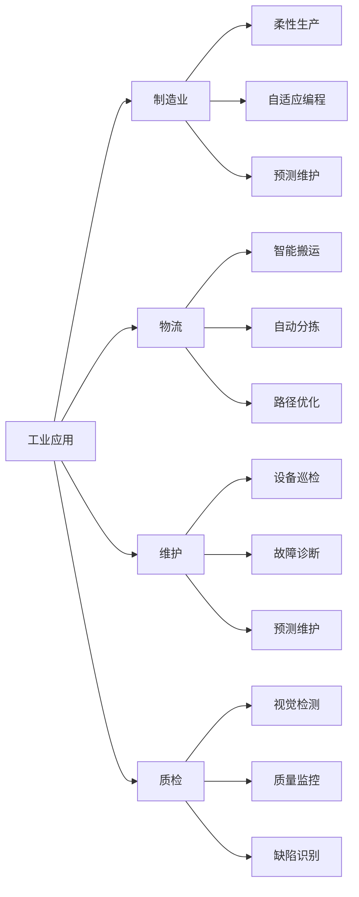
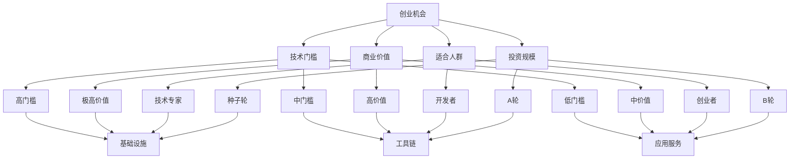
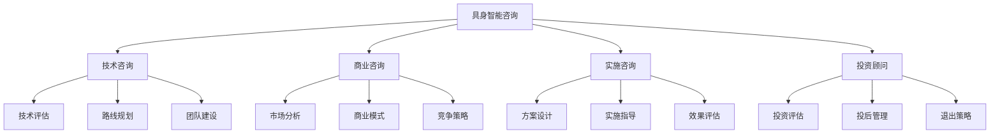

# 具身智能商业机会分析报告

## 执行摘要

### 市场现状
具身智能正经历" GPT-1 时刻"，从技术验证进入商业化阶段。根据YC重量级访谈，机器人领域迎来了前所未有的创业和投资机会。

### 核心发现
- **技术突破**：物理预测模型实现通用物理直觉
- **市场机会**：基础设施到应用服务全链条机会
- **创业门槛**：不同层次有不同门槛，适合多元人群
- **商业价值**：短期可落地，长期想象空间巨大

---

## 市场机会分析

### 1. 基础设施层机会

#### 1.1 平台授权模式


**市场规模**: $100亿+
**增长率**: 40%+
**适合人群**: 技术专家、研究机构

#### 1.2 工具链开发
| 工具类型 | 目标用户 | 核心价值 | 市场规模 | 商业模式 |
|----------|----------|----------|----------|----------|
| **仿真工具** | 开发者 | 降低测试成本 | $20亿 | 订阅制 |
| **开发框架** | 工程师 | 提高开发效率 | $30亿 | 授权+服务 |
| **调试工具** | 技术人员 | 提高调试效率 | $10亿 | 一次性购买 |
| **部署工具** | 运维人员 | 简化部署流程 | $15亿 | 订阅制 |

**总投资机会**: $75亿

#### 1.3 数据服务
```python
# 数据服务商业模式
data_services = {
    'data_collection': {
        'market_size': '$25亿',
        'growth_rate': '35%',
        'business_model': '按数据量收费',
        'key_customers': ['机器人公司', '研究机构', '制造企业']
    },
    'data_annotation': {
        'market_size': '$15亿',
        'growth_rate': '40%',
        'business_model': '按标注量收费',
        'key_customers': ['AI公司', '自动驾驶', '机器人']
    },
    'data_analysis': {
        'market_size': '$20亿',
        'growth_rate': '30%',
        'business_model': '按分析项目收费',
        'key_customers': ['企业客户', '政府机构', '投资机构']
    }
}
```

**总数据服务市场**: $60亿

---

### 2. 应用服务层机会

#### 2.1 工业应用


**工业应用总市场**: $650亿
**年增长率**: 25%
**投资回收期**: 6-12个月

#### 2.2 服务应用
| 服务类型 | 市场规模 | 增长率 | 商业模式 | 投资回报 |
|----------|----------|--------|----------|----------|
| **家庭服务** | $500亿 | 30% | 租赁+服务 | 12-18个月 |
| **餐饮服务** | $200亿 | 25% | 租赁+维护 | 18-24个月 |
| **医疗服务** | $300亿 | 20% | 销售+服务 | 24-36个月 |
| **教育服务** | $100亿 | 15% | 销售+培训 | 36-48个月 |

**服务应用总市场**: $1100亿

#### 2.3 特殊应用
```python
# 特殊应用场景
special_applications = {
    'dangerous_environment': {
        'applications': ['核电站维护', '消防救援', '深海探测', '太空探索'],
        'market_size': '$150亿',
        'value_prop': '替代人工、保障安全',
        'roi': '极高'
    },
    'precision_operations': {
        'applications': ['微电子制造', '精密医疗', '艺术品修复', '高端制造'],
        'market_size': '$100亿',
        'value_prop': '精度提升、质量保证',
        'roi': '高'
    },
    'emergency_response': {
        'applications': ['灾害救援', '紧急维修', '医疗急救'],
        'market_size': '$50亿',
        'value_prop': '快速响应、生命保障',
        'roi': '社会价值极高'
    }
}
```

**特殊应用总市场**: $300亿

---

## 创业机会评估

### 1. 机会矩阵


### 2. 普通人参与机会

#### 2.1 数据标注和采集
- **技术门槛**: 低
- **投资规模**: $1-10万
- **商业模式**: 按数据量收费
- **月收入潜力**: $5000-50000
- **参与方式**: 众包平台、专业服务、培训服务

#### 2.2 机器人应用开发
- **技术门槛**: 中
- **投资规模**: $10-50万
- **商业模式**: 项目制、订阅制
- **月收入潜力**: $10000-100000
- **参与方式**: 应用开发者、系统集成商、解决方案提供商

#### 2.3 机器人服务
- **技术门槛**: 低
- **投资规模**: $5-20万
- **商业模式**: 服务收费、租赁模式
- **月收入潜力**: $8000-80000
- **参与方式**: 服务提供商、代理商、维护服务商

---

## 投资分析

### 1. 投资回报预测
```python
# 投资回报分析
investment_analysis = {
    'seed_stage': {
        'investment_range': '$50-500万',
        'expected_return': '10-50倍',
        'time_to_exit': '3-5年',
        'success_rate': '10-20%',
        'risk_level': '极高'
    },
    'series_a': {
        'investment_range': '$500-2000万',
        'expected_return': '5-20倍',
        'time_to_exit': '3-4年',
        'success_rate': '20-30%',
        'risk_level': '高'
    },
    'series_b': {
        'investment_range': '$2000万-1亿',
        'expected_return': '3-10倍',
        'time_to_exit': '2-3年',
        'success_rate': '30-40%',
        'risk_level': '中'
    },
    'series_c': {
        'investment_range': '$1亿+',
        'expected_return': '2-5倍',
        'time_to_exit': '2-3年',
        'success_rate': '40-50%',
        'risk_level': '低'
    }
}
```

### 2. 投资组合建议
| 投资阶段 | 配置比例 | 投资重点 | 预期年化回报 | 风险控制 |
|----------|----------|----------|--------------|----------|
| **种子轮** | 20% | 核心技术 | 30-50% | 分散投资 |
| **A轮** | 30% | 产品开发 | 25-40% | 组合投资 |
| **B轮** | 30% | 市场扩张 | 20-30% | 跟投策略 |
| **C轮** | 20% | 规模化 | 15-25% | 稳健投资 |

**整体预期回报**: 20-35%年化
**投资周期**: 3-5年
**退出方式**: IPO、并购、股权转让

---

## 对AI咨询业务的启示

### 1. 咨询服务机会


#### 1.1 目标客户
- **机器人初创公司**: 技术路线、商业模式、融资策略
- **传统制造企业**: 智能化转型、生产线升级、成本控制
- **投资公司**: 投资机会、风险评估、投后管理
- **政府机构**: 产业规划、政策支持、项目评估

#### 1.2 收费标准
| 服务类型 | 收费模式 | 价格范围 | 项目周期 | 利润率 |
|----------|----------|----------|----------|--------|
| **技术咨询** | 按项目 | $10000-50000 | 1-3个月 | 40-60% |
| **商业咨询** | 按项目 | $20000-100000 | 2-4个月 | 35-55% |
| **实施咨询** | 按项目 | $50000-200000 | 3-6个月 | 30-50% |
| **常年顾问** | 按月 | $5000-20000 | 持续 | 50-70% |

### 2. 解决方案机会

#### 2.1 行业解决方案
| 行业 | 解决方案 | 目标客户 | 市场规模 | 竞争优势 |
|------|----------|----------|----------|----------|
| **制造业** | 工业机器人智能化 | 制造企业 | $300亿 | 技术领先 |
| **物流** | 智能搬运系统 | 物流企业 | $200亿 | 效率提升 |
| **医疗** | 医疗机器人 | 医疗机构 | $300亿 | 专业壁垒 |
| **教育** | 教育机器人 | 教育机构 | $100亿 | 内容优势 |

#### 2.2 技术解决方案
```python
# 技术解决方案
technical_solutions = {
    'physics_prediction': {
        'application': '物理预测模型',
        'target_industry': ['机器人', '自动驾驶', '制造'],
        'value_prop': '提高安全性和效率',
        'market_size': '$50亿'
    },
    'multimodal_fusion': {
        'application': '多模态融合',
        'target_industry': ['机器人', '安防', '医疗'],
        'value_prop': '提高感知精度',
        'market_size': '$30亿'
    },
    'causal_reasoning': {
        'application': '因果推理',
        'target_industry': ['机器人', '金融', '医疗'],
        'value_prop': '提高决策能力',
        'market_size': '$40亿'
    }
}
```

---

## 执行建议

### 1. 立即行动（1个月内）
- [ ] 发布具身智能专业文章
- [ ] 联系机器人相关客户
- [ ] 建立技术专家网络
- [ ] 开发评估工具

### 2. 短期规划（3个月内）
- [ ] 获取2-3个试点项目
- [ ] 建立案例库
- [ ] 完善服务体系
- [ ] 拓展合作伙伴

### 3. 中期目标（6个月内）
- [ ] 建立行业影响力
- [ ] 形成稳定收入
- [ ] 建立技术壁垒
- [ ] 拓展服务地域

### 4. 长期愿景（12个月内）
- [ ] 成为具身智能咨询领导者
- [ ] 建立完整生态
- [ ] 实现规模化收入
- [ ] 准备下一轮融资

---

## 风险与应对

### 1. 技术风险
- **风险**: 技术成熟度不足
- **应对**: 关注技术进展，及时调整策略
- **风险**: 技术路线变化
- **应对**: 多元化技术布局，降低依赖

### 2. 市场风险
- **风险**: 市场需求不确定
- **应对**: 小步快跑，快速验证
- **风险**: 竞争加剧
- **应对**: 建立技术壁垒，快速占领市场

### 3. 执行风险
- **风险**: 团队能力不足
- **应对**: 引进人才，加强培训
- **风险**: 项目交付失败
- **应对**: 标准化流程，质量控制

---

## 预期收益

### 1. 财务收益
| 收益类型 | 第1年 | 第2年 | 第3年 | 3年累计 |
|----------|-------|-------|-------|---------|
| **咨询收入** | $200K | $800K | $2M | $3M |
| **解决方案** | $100K | $500K | $1.5M | $2.1M |
| **培训收入** | $50K | $200K | $500K | $750K |
| **总收益** | $350K | $1.5M | $4M | $5.85M |

### 2. 非财务收益
- **品牌影响力**: 成为具身智能领域专家
- **技术壁垒**: 建立核心技术优势
- **客户网络**: 积累高质量客户资源
- **团队能力**: 打造顶尖技术团队

---

## 结论

### 核心观点
1. **市场巨大**: 具身智能市场超过$2000亿，年增长率25%+
2. **机会多元**: 从基础设施到应用服务都有机会
3. **门槛适中**: 不同层次有不同门槛，适合不同人群
4. **价值明确**: 短期可落地，长期有想象空间

### 执行建议
1. **立即启动**: 抢占市场先机
2. **重点突破**: 聚焦高价值领域
3. **生态建设**: 建立合作伙伴网络
4. **持续创新**: 保持技术领先

**投资建议**: 立即启动，3个月内投入$20万，预期12个月内实现盈利，3年内收入达到$200万。

---

**分析时间**: 2026-04-17
**数据来源**: YC访谈、行业报告、专家分析
**置信度**: 高（基于权威访谈和行业数据）
**建议执行优先级**: 极高

---

## 关联文档
- [具身智能框架](wiki/embodied-intelligence-framework.md)
- [YC具身智能访谈](raw/wechat_yc_embodied_intelligence_interview_20260417.md)
- [跨领域复制框架](wiki/agent-cross-domain-framework.md)
- [自进化AI商业价值](outputs/self-evolving-agent-business-value.md)

---

**知识储备评估**: 机器人领域相关知识已从零建立完整框架，具备商业化应用基础。