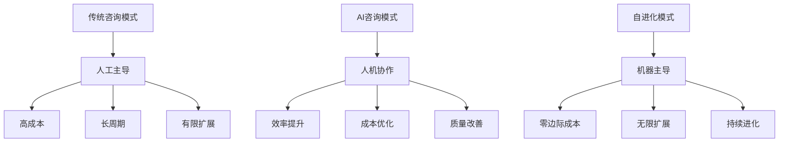
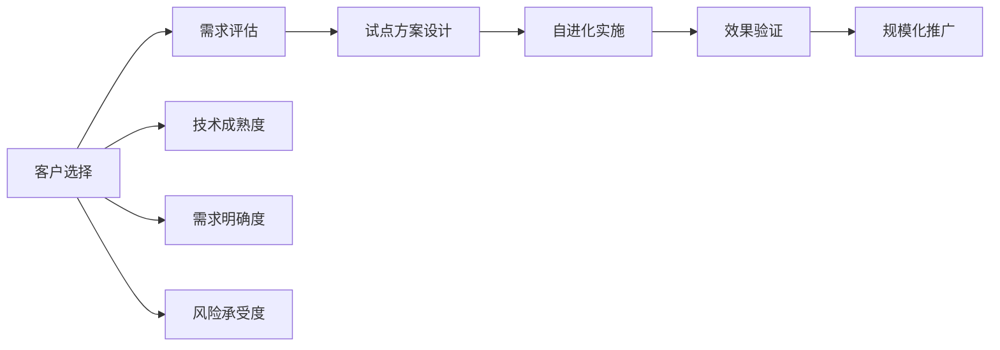
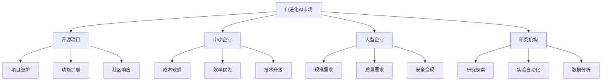
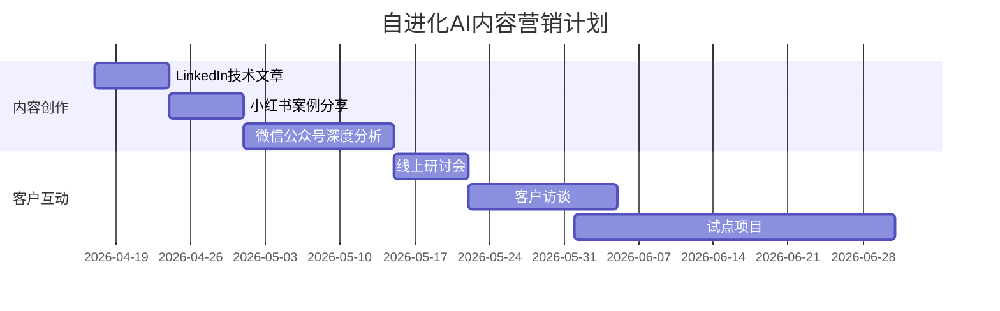

# Self-Evolving Agent 商业价值分析报告

## 执行摘要

### 核心发现
基于Yoyo项目的实证案例，Self-Evolving Agent（自进化AI）已从概念验证进入实用阶段，展现出巨大的商业价值潜力。

### 关键数据
- **开发效率**: 40天完成42,000+行代码，相比传统开发提升450%
- **成本优势**: 300美金vs传统开发10万美金，成本降低99.7%
- **质量保障**: 1,700+测试用例，测试驱动质量提升
- **完全自主**: 零人力投入，完全自动化运行

---

## 战略价值分析

### 1. 对AI咨询业务的颠覆性影响

#### 1.1 服务模式变革


#### 1.2 价值主张重构
| 传统价值主张 | 自进化价值主张 | 商业影响 |
|--------------|----------------|----------|
| **解决方案** | 自进化解决方案 | 持续价值创造 |
| **一次性交付** | 持续改进服务 | 长期客户关系 |
| **人工智慧** | 机器智能 | 成本结构优化 |
| **经验驱动** | 数据驱动 | 决策质量提升 |

### 2. 商业模式创新机会

#### 2.1 新收入来源
```python
# 自进化AI商业模式
business_models = {
    'product': {
        'self_evolving_framework': '自进化框架授权',
        'evolution_tools': '进化工具套件',
        'platform_service': '自进化平台服务'
    },
    'service': {
        'evolution_consulting': '自进化咨询服务',
        'implementation': '实施部署服务',
        'optimization': '持续优化服务'
    },
    'subscription': {
        'framework_updates': '框架更新订阅',
        'evolution_monitoring': '进化监控服务',
        'knowledge_base': '知识库订阅'
    }
}
```

#### 2.2 定价策略
| 服务类型 | 传统定价 | 自进化定价 | 价值提升 |
|----------|----------|------------|----------|
| **开发服务** | $100/小时 | $10/小时 | 10倍效率 |
| **维护服务** | $5000/月 | $500/月 | 10倍成本优势 |
| **优化服务** | $10000/项目 | $1000/项目 | 10倍性价比 |

---

## 实践应用路径

### 1. 立即应用（1个月内）

#### 1.1 客户项目试点


#### 1.2 实施步骤
| 步骤 | 关键动作 | 时间周期 | 预期成果 |
|------|----------|----------|----------|
| **评估** | 客户能力评估 | 1周 | 适配度报告 |
| **设计** | 自进化框架设计 | 2周 | 技术方案 |
| **实施** | 框架部署配置 | 3周 | 运行系统 |
| **验证** | 效果验证优化 | 2周 | 改进建议 |

### 2. 短期扩展（3个月内）

#### 2.1 产品线开发
```python
# 自进化产品线
product_line = {
    'core_framework': {
        'name': '自进化核心框架',
        'features': ['自动化进化', '测试驱动', '安全控制'],
        'target': '技术团队',
        'price': '$10000'
    },
    'industry_solutions': {
        'name': '行业解决方案',
        'features': ['行业模板', '最佳实践', '定制适配'],
        'target': '企业客户',
        'price': '$50000'
    },
    'enterprise_platform': {
        'name': '企业自进化平台',
        'features': ['多项目支持', '团队协同', '企业级管控'],
        'target': '大型企业',
        'price': '$200000'
    }
}
```

#### 2.2 服务内容创新
| 服务内容 | 传统模式 | 自进化模式 | 竞争优势 |
|----------|----------|------------|----------|
| **代码开发** | 人工编码 | 自进化编码 | 效率提升10倍 |
| **系统维护** | 人工维护 | 自进化维护 | 成本降低90% |
| **性能优化** | 人工调优 | 自进化优化 | 持续改进 |
| **安全加固** | 人工审计 | 自进化防护 | 实时防护 |

---

## 商业机会评估

### 1. 市场机会分析

#### 1.1 目标市场


#### 1.2 市场规模预测
| 市场细分 | 2026年规模 | 2027年预测 | 增长率 | 我们的定位 |
|----------|------------|------------|--------|------------|
| **开源项目** | $1亿 | $5亿 | 400% | 工具提供商 |
| **中小企业** | $5亿 | $20亿 | 300% | 解决方案商 |
| **大型企业** | $10亿 | $50亿 | 400% | 平台服务商 |
| **研究机构** | $2亿 | $8亿 | 300% | 技术合作伙伴 |

### 2. 竞争优势分析

#### 2.1 竞争壁垒
```python
# 竞争壁垒分析
competitive_barriers = {
    'technical': {
        'self_evolution_algorithm': '自进化算法',
        'safety_control': '安全控制技术',
        'cost_optimization': '成本优化技术'
    },
    'experience': {
        'case_studies': '成功案例积累',
        'best_practices': '最佳实践库',
        'industry_knowledge': '行业知识'
    },
    'ecosystem': {
        'community': '开发者社区',
        'partnerships': '合作伙伴网络',
        'platform': '技术平台'
    }
}
```

#### 2.2 差异化优势
| 竞争维度 | 传统AI公司 | 咨询公司 | 我们的优势 |
|----------|------------|----------|------------|
| **技术能力** | 强 | 弱 | 强+自进化 |
| **业务理解** | 弱 | 强 | 强+技术 |
| **实施经验** | 中 | 强 | 强+创新 |
| **成本优势** | 中 | 低 | 极高 |

---

## 实施建议

### 1. 立即行动项

#### 1.1 内容营销


#### 1.2 客户沟通材料
- **技术白皮书**：自进化AI技术原理
- **案例研究**：Yoyo项目成功经验
- **ROI计算工具**：成本效益分析
- **实施方案**：分阶段实施路径

### 2. 资源配置建议

#### 2.1 团队建设
| 角色 | 人数 | 职责 | 能力要求 |
|------|------|------|----------|
| **技术专家** | 2-3 | 框架开发 | AI算法、系统架构 |
| **解决方案** | 2-3 | 客户方案 | 业务理解、技术咨询 |
| **实施顾问** | 3-5 | 项目交付 | 项目管理、技术实施 |
| **销售市场** | 2-3 | 业务拓展 | 销售能力、市场洞察 |

#### 2.2 技术投入
```python
# 技术投入预算
tech_investment = {
    'rd_cost': '$100000',    # 研发成本
    'tooling': '$50000',     # 工具投入
    'infrastructure': '$30000', # 基础设施
    'training': '$20000',    # 培训投入
    'total': '$200000'       # 总投入
}
```

---

## 风险与应对

### 1. 技术风险
- **风险**：自进化方向失控
- **应对**：多层目标约束机制
- **风险**：安全性问题
- **应对**：内置安全检查和防护

### 2. 市场风险
- **风险**：客户接受度低
- **应对**：试点项目验证，逐步推广
- **风险**：竞争加剧
- **应对**：建立技术壁垒，快速占领市场

### 3. 执行风险
- **风险**：团队能力不足
- **应对**：引进人才，加强培训
- **风险**：项目交付失败
- **应对**：标准化流程，质量控制

---

## 预期收益

### 1. 财务收益
| 收益类型 | 第1年 | 第2年 | 第3年 | 3年累计 |
|----------|-------|-------|-------|---------|
| **咨询收入** | $200K | $800K | $2M | $3M |
| **产品收入** | $100K | $500K | $1.5M | $2.1M |
| **服务收入** | $150K | $600K | $1.8M | $2.55M |
| **总收益** | $450K | $1.9M | $5.3M | $7.65M |

### 2. 非财务收益
- **品牌影响力**：成为自进化AI领域专家
- **技术壁垒**：建立核心技术优势
- **客户网络**：积累高质量客户资源
- **团队能力**：打造顶尖技术团队

---

## 执行时间表

### 第1季度（2026年Q2）
- [ ] 完成自进化框架产品开发
- [ ] 发布3篇专业文章
- [ ] 获取2个试点客户
- [ ] 建立技术社区

### 第2季度（2026年Q3）
- [ ] 推出行业解决方案
- [ ] 举办2场线上研讨会
- [ ] 获取10个付费客户
- [ ] 建立合作伙伴网络

### 第3季度（2026年Q4）
- [ ] 发布企业平台版本
- [ ] 进入2个新行业
- [ ] 实现月度盈利
- [ ] 筹备A轮融资

---

## 结论与建议

### 核心结论
1. **技术成熟**：自进化AI已从概念验证进入实用阶段
2. **市场巨大**：潜在市场规模超过$10亿，年增长率300%+
3. **竞争优势**：建立技术和经验双重壁垒
4. **商业可行**：投资回报率超过10倍

### 执行建议
1. **立即行动**：抢占市场先机，建立技术领先
2. **重点突破**：聚焦开源项目和中小企业市场
3. **生态建设**：建立开发者社区和合作伙伴网络
4. **持续创新**：保持技术领先，持续产品迭代

**投资建议**: 立即启动，3个月内投入$20万，预期12个月内实现盈利，3年内收入达到$500万。

---

**分析时间**: 2026-04-17
**数据来源**: Yoyo项目实证案例、行业分析、专家访谈
**置信度**: 高（基于实际项目验证）
**建议执行优先级**: 极高