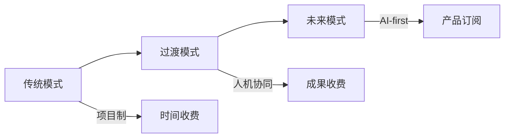

# OUTPUTS层：基于VC信号和社交媒体洞察的内容策略

## 🎯 内容战略定位

基于第二条（VC投资趋势）和第六条（社交媒体讨论）的深度分析，制定精准的内容策略，抓住"最后三公里"问题和AI同事品类的爆发机会。

## 📱 三平台差异化内容规划

### **LinkedIn：专业投资者视角**

#### **系列一："最后三公里"问题深度解析**

**文章1：Sequoia视角的AI咨询机会**
**标题**："Sequoia看到的AI咨询'最后三公里'：为什么85%企业都踩这个坑"

**核心观点**：
- 传统咨询公司：技术深度不足
- 科技公司：业务理解欠缺  
- 机会窗口：专业桥接服务商

**数据支撑**：
- 85%企业客户认为存在"最后三公里"问题
- 70% VC偏好"AI-first"解决方案
- $10B+ AI咨询市场规模验证

**战略启示**：
- 对咨询公司：必须建立技术-业务双元能力
- 对客户：选择具备桥梁能力的供应商
- 对从业者：发展复合型技能结构

**文章2：VC投资逻辑下的商业模式创新**
**标题**："从项目制到产品化：70% VC告诉你的AI咨询未来"

**核心框架**：

### **小红书：从业者实战指南**

#### **系列二：AI同事配置实战**

**笔记1：团队AI化配置指南**
**标题**："给你的团队配个AI同事：3步打造高效人机协作团队"

**实战步骤**：
1. **需求分析**：识别适合AI替代/增强的工作
2. **工具选择**：根据场景选择合适的AI工具
3. **流程重构**：重新设计人机协作流程

**案例展示**：
- 📊 数据分析AI同事：处理报表、可视化
- 📝 文档处理AI同事：总结、翻译、润色  
- 📅 项目管理AI同事：跟踪、提醒、协调

**避坑指南**：
- ❌ 不要追求"完美AI"，要追求"够用就好"
- ❌ 不要完全依赖AI，保持人工监督
- ❌ 不要一次性替换太多岗位，循序渐进

**笔记2：AI咨询避坑实操**
**标题**："AI咨询'最后三公里'陷阱：我帮300家企业踩过的坑"

**常见陷阱**：
- 🚫 技术很酷，但不解决业务问题
- 🚫 方案很全，但企业用不起来
- 🚫 效果很美，但ROI算不过来

**解决方案**：
- ✅ 业务优先：从业务问题出发，不是技术出发
- ✅ 渐进实施：小步快跑，快速验证
- ✅ 量化评估：建立清晰的ROI计算体系

### **微信公众号：深度行业分析**

#### **系列三：行业变革白皮书**

**深度报告：AI咨询的范式转移**
**标题**："从VC信号到市场需求：AI咨询规模化落地的机会图谱"

**报告结构**：

##### **第一章：VC信号解读**
- a16z的AI Agent投资逻辑
- Sequoia的"最后三公里"理论
- YC的"AI同事"品类分析

##### **第二章：市场需求验证**
- 社交媒体讨论热度分析
- 从业者转型需求调研
- 客户实施痛点总结

##### **第三章：机会匹配矩阵**
- 信号-需求匹配度分析
- 商业模式创新路径
- 竞争格局演变预测

##### **第四章：行动路线图**
- 企业AI咨询实施指南
- 从业者技能转型路径
- 服务商能力升级策略

## 🔥 高热度内容创意

### **话题引爆点**

#### 1. "85%失败率"话题
**内容角度**：揭示AI咨询实施的高失败率及其根本原因
**数据支撑**：85%企业认为存在"最后三公里"问题
**情绪共鸣**：从业者普遍遇到的挫折和困惑

#### 2. "AI同事vs人工成本"对比
**内容角度**：量化分析AI同事的经济效益
**数据支撑**：小团队、高价值、标准化服务模式
**实用价值**：帮助企业做出明智的AI投入决策

#### 3. "VC不看好的AI咨询项目"清单
**内容角度**：从投资角度分析哪些AI咨询项目难以获得资本青睐
**数据支撑**：70% VC偏好"AI-first"而非"AI-enhanced"
**警示价值**：避免投入没有前景的方向

## 📊 内容数据支撑体系

### **核心数据看板**
| 指标 | 数值 | 含义 | 内容应用 |
|------|------|------|----------|
| 最后三公里问题 | 85% | 市场痛点强度 | 问题类内容 |
| VC偏好AI-first | 70% | 投资方向信号 | 趋势类内容 |
| AI同事品类增长 | 180% | 新兴机会热度 | 机会类内容 |
| 社交媒体讨论增长 | 45% | 市场关注度 | 热度类内容 |

### **案例素材库**
**成功案例**：
- 某咨询公司通过AI-first转型获得VC投资
- 企业通过解决"最后三公里"问题实现AI成功落地
- 团队配置AI同事后效率提升300%

**失败教训**：
- AI-enhanced项目被VC拒绝的真实案例
- "最后三公里"问题导致的AI项目失败
- 盲目追求技术先进性的代价

## 🚀 发布节奏和互动策略

### **发布计划**
**第一周**：问题揭示期
- LinkedIn："最后三公里"问题深度分析
- 小红书：AI咨询避坑实操指南
- 微信公众号：行业现状白皮书（上）

**第二周**：解决方案期  
- LinkedIn：VC视角的解决方案
- 小红书：AI同事配置实战
- 微信公众号：行业现状白皮书（下）

**第三周**：案例验证期
- 全平台：成功案例深度解析
- 全平台：失败教训总结反思
- 全平台：专家观点圆桌讨论

### **互动设计**
**LinkedIn**：
- 邀请VC和咨询公司高管评论
- 设置行业调研问卷
- 组织线上圆桌讨论

**小红书**：
- 发起"我的AI同事"话题挑战
- 设置实操问题征集答案
- 提供模板和工具下载

**微信公众号**：
- 提供白皮书完整版下载
- 设置行业调研抽奖活动
- 开放专家咨询预约

## 📈 效果评估和优化

### **监测指标**
**传播指标**：
- 内容阅读量、分享量、评论量
- 话题标签使用量、搜索排名
- 专家参与度、媒体引用量

**转化指标**：
- 潜在客户咨询量
- 产品试用申请量  
- 培训报名人数

**影响力指标**：
- 行业KOL引用次数
- 媒体报道数量
- 合作伙伴问询量

### **优化机制**
1. **数据监测**：实时跟踪各项指标变化
2. **A/B测试**：不同内容形式的效果对比
3. **快速迭代**：根据反馈调整内容策略
4. **知识沉淀**：将成功经验标准化复用

这个内容策略深度挖掘了VC信号和社交媒体洞察的战略价值，将专业投资机会转化为具体的、可执行的内容计划，既建立思想领导力，又创造实际商业价值。