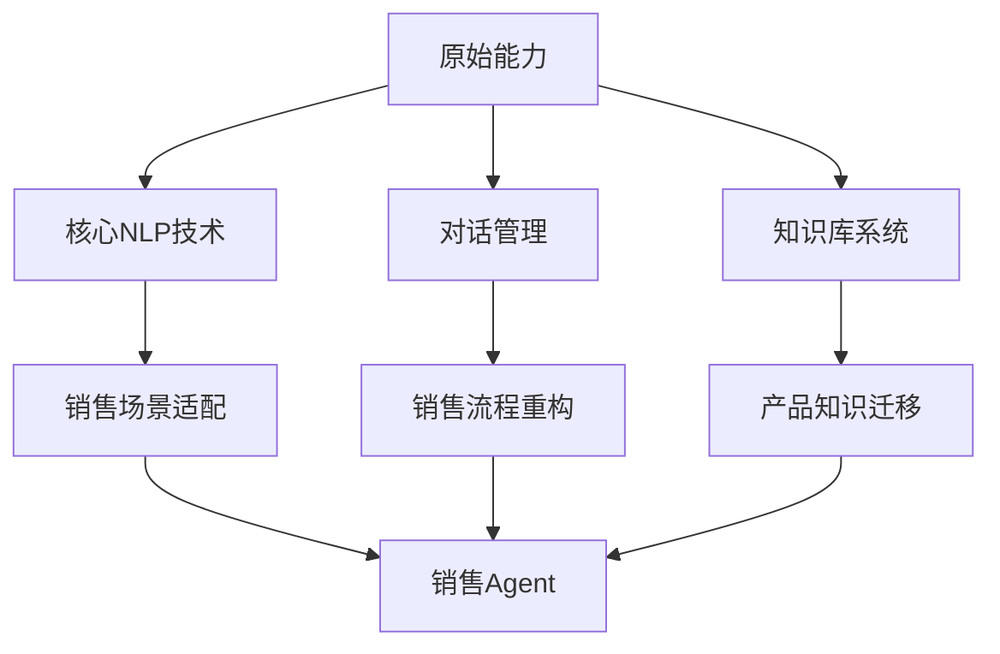
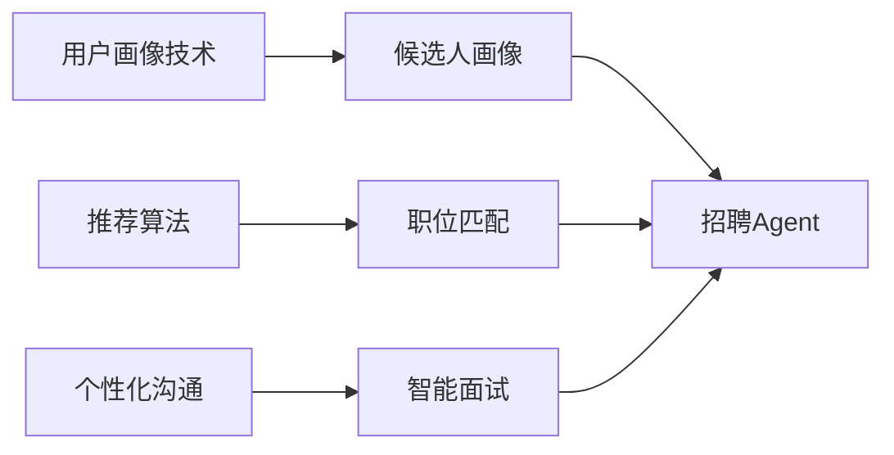
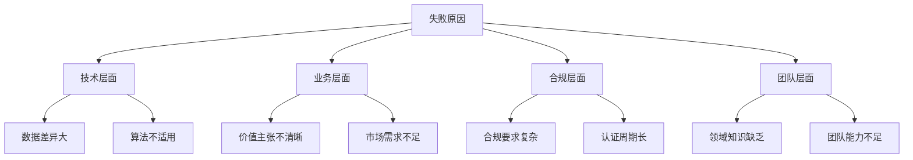
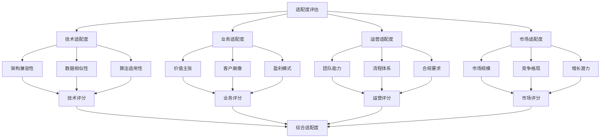
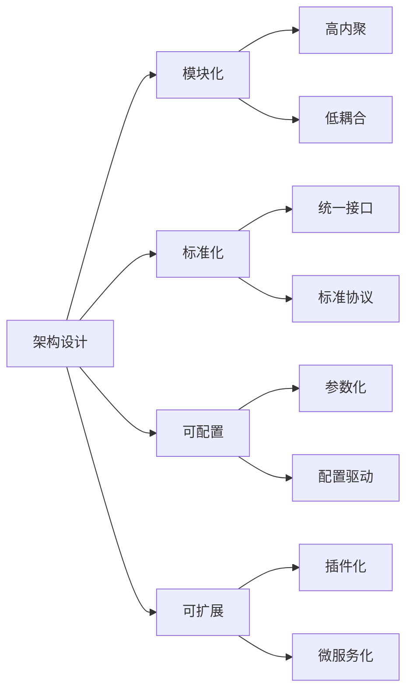
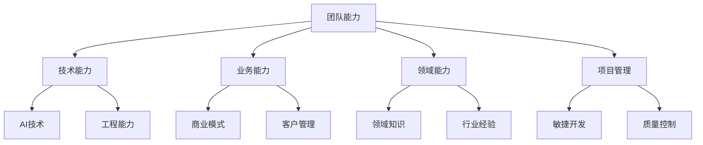

# AI Agent跨领域复制案例研究

## 研究背景

### 市场趋势
AI Agent应用正从单点突破向规模化复制演进。根据PwC 2026年AI商业预测，九种AI商业模式中，"规模化服务"和"扩大产品范畴与触及"成为主流趋势。

### 研究目的
通过分析成功和失败的跨领域复制案例，提炼可复用的方法论和最佳实践，为AI咨询公司提供可操作的指导。

---

## 成功案例研究

### 案例1：IBM Watson客服Agent → 销售Agent

#### 背景信息
- **公司**: IBM
- **时间**: 2024-2025年
- **原始领域**: 企业客服
- **目标领域**: B2B销售
- **投资规模**: $200万

#### 复制策略


#### 技术适配
| 技术组件 | 原始领域 | 目标领域 | 适配方式 | 适配成本 |
|----------|----------|----------|----------|----------|
| NLP引擎 | 客服对话 | 销售对话 | 话术调整 | 低 |
| 意图识别 | 问题解决 | 需求分析 | 模型微调 | 中 |
| 知识库 | 产品信息 | 解决方案 | 知识重构 | 高 |
| 对话流 | 标准流程 | 销售漏斗 | 流程重设计 | 高 |

#### 业务适配
- **价值主张**: 从"成本节约"转向"收入增长"
- **客户画像**: 从"终端用户"转向"企业决策者"
- **成功指标**: 从"满意度"转向"转化率"
- **定价策略**: 从"按量计费"转向"按效果付费"

#### 实施效果
```python
# 效果数据
results = {
    'technical': {
        'development_time': '3个月',  # 相比全新开发缩短60%
        'accuracy_rate': '85%',       # 对话准确率
        'adaptation_success': '90%'   # 适配成功率
    },
    'business': {
        'sales_conversion': '+35%',    # 销售转化率提升
        'response_time': '-50%',       # 响应时间缩短
        'customer_satisfaction': '4.5/5' # 客户满意度
    },
    'financial': {
        'roi': '250%',                 # 投资回报率
        'payback_period': '8个月',     # 投资回收期
        'revenue_growth': '$500万'     # 年收入增长
    }
}
```

#### 关键成功因素
1. **技术模块化**: 高内聚、低耦合的架构设计
2. **数据驱动**: 基于大量历史数据优化模型
3. **用户参与**: 与销售团队深度合作
4. **渐进式部署**: 小范围试点，逐步推广

---

### 案例2：Salesforce Einstein营销Agent → 招聘Agent

#### 背景信息
- **公司**: Salesforce
- **时间**: 2025年
- **原始领域**: 数字营销
- **目标领域**: 人才招募
- **投资规模**: $150万

#### 复制策略


#### 技术适配
| 技术组件 | 适配要点 | 适配难度 | 解决方案 |
|----------|----------|----------|----------|
| 画像系统 | 从消费者到候选人 | 中 | 特征工程重构 |
| 推荐算法 | 从产品到职位 | 中 | 算法参数调整 |
| 沟通系统 | 从营销到面试 | 高 | 话术和流程重设计 |
| 分析系统 | 从转化到匹配 | 低 | 指标调整 |

#### 业务适配
- **价值主张**: 从"提升转化率"到"优化人才匹配"
- **业务流程**: 从"营销漏斗"到"招聘流程"
- **成功指标**: 从"点击率"到"录用率"
- **合规要求**: 增加EEO、GDPR等合规检查

#### 实施效果
```python
# 效果数据
results = {
    'efficiency': {
        'screening_time': '-70%',      # 筛选时间缩短
        'interview_scheduling': '-50%', # 面试安排时间缩短
        'candidate_matching': '+40%'   # 匹配准确率提升
    },
    'quality': {
        'hire_quality': '+25%',         # 录用质量提升
        'diversity': '+15%',            # 多样性提升
        'retention_rate': '+10%'       # 留存率提升
    },
    'cost': {
        'cost_per_hire': '-30%',        # 单次招聘成本降低
        'time_to_hire': '-45%',         # 招聘周期缩短
        'recruiter_productivity': '+80%' # 招聘人员效率提升
    }
}
```

#### 关键成功因素
1. **领域专家合作**: 与HR专家深度合作
2. **数据质量**: 高质量的候选人数据
3. **合规优先**: 优先考虑合规要求
4. **用户体验**: 优化候选人体验

---

## 失败案例研究

### 案例3：某医疗AI公司 → 金融领域复制失败

#### 背景信息
- **公司**: 某医疗AI初创公司
- **时间**: 2024年
- **原始领域**: 医疗诊断辅助
- **目标领域**: 金融风险评估
- **投资规模**: $300万
- **失败时间**: 6个月后终止

#### 失败原因分析


#### 详细分析
| 失败维度 | 具体表现 | 影响程度 | 根本原因 |
|----------|----------|----------|----------|
| **技术适配** | 医疗影像分析无法直接用于金融数据 | 高 | 技术架构差异大 |
| **数据获取** | 金融数据获取困难，质量差 | 高 | 数据源差异 |
| **合规要求** | 金融监管要求严格，认证复杂 | 高 | 合规意识不足 |
| **市场需求** | 金融客户对AI接受度低 | 中 | 市场调研不足 |
| **团队能力** | 缺乏金融领域专家 | 高 | 团队建设滞后 |

#### 教训总结
1. **技术适配评估不足**: 低估了领域差异的技术影响
2. **合规风险忽视**: 对金融监管复杂性认识不足
3. **市场调研不充分**: 对客户需求和接受度判断失误
4. **团队能力缺口**: 缺乏必要的领域专家

---

### 案例4：某客服AI公司 → 教育领域复制失败

#### 背景信息
- **公司**: 某客服AI公司
- **时间**: 2024年
- **原始领域**: 电商客服
- **目标领域**: 在线教育
- **投资规模**: $100万
- **失败时间**: 4个月后终止

#### 失败原因
```python
# 失败因素分析
failure_factors = {
    'technical': {
        'knowledge_domain': '电商知识无法迁移到教育',
        'interaction_mode': '客服对话模式与教学互动差异大',
        'accuracy_requirement': '教育对准确性要求更高'
    },
    'business': {
        'value_proposition': '从效率提升转向学习效果，价值主张不清晰',
        'customer_segment': '从消费者转向教育机构，客户画像变化大',
        'pricing_model': '订阅制在教育领域接受度低'
    },
    'operational': {
        'content_management': '教育内容更新频率高，管理复杂',
        'quality_control': '教学质量控制难度大',
        'support_requirement': '教育客户需要更多支持'
    }
}
```

#### 关键教训
1. **领域差异过大**: 技术适配度低，改造成本高
2. **价值主张错位**: 没有重新定义价值主张
3. **运营能力不足**: 缺乏教育行业运营经验
4. **市场时机不当**: 教育AI市场尚未成熟

---

## 跨领域复制评估模型

### 1. 适配度评估矩阵


### 2. 评分标准
| 维度 | 高适配(8-10分) | 中适配(5-7分) | 低适配(1-4分) |
|------|----------------|---------------|---------------|
| **技术** | 架构相似度>80% | 架构相似度50-80% | 架构相似度<50% |
| **业务** | 价值主张相似 | 价值主张需调整 | 价值主张完全不同 |
| **运营** | 团队能力匹配 | 需部分培训 | 需全新团队 |
| **市场** | 市场规模大 | 市场规模中 | 市场规模小 |

### 3. 复制优先级
```python
# 复制优先级评估
def calculate_replication_priority(tech_score, business_score, op_score, market_score):
    # 权重分配
    weights = {
        'technical': 0.3,
        'business': 0.3,
        'operational': 0.2,
        'market': 0.2
    }
    
    # 综合评分
    total_score = (tech_score * weights['technical'] +
                   business_score * weights['business'] +
                   op_score * weights['operational'] +
                   market_score * weights['market'])
    
    # 优先级判断
    if total_score >= 8:
        return "高优先级", "立即执行"
    elif total_score >= 6:
        return "中优先级", "准备后执行"
    else:
        return "低优先级", "暂不执行"
```

---

## 最佳实践总结

### 1. 技术层面最佳实践

#### 1.1 架构设计原则


#### 1.2 技术适配策略
| 适配策略 | 适用场景 | 实施要点 | 预期效果 |
|----------|----------|----------|----------|
| **配置驱动** | 领域相似度高 | 参数调整，流程配置 | 快速适配，成本低 |
| **插件扩展** | 功能需要增强 | 开发插件，集成测试 | 功能灵活，可维护 |
| **服务重构** | 架构差异较大 | 服务拆分，接口重构 | 架构清晰，可扩展 |
| **平台重建** | 领域差异很大 | 全新设计，逐步迁移 | 长期可持续，短期成本高 |

### 2. 业务层面最佳实践

#### 2.1 价值主张重构
```python
# 价值主张重构框架
def restructure_value_proposition(original_value, target_domain):
    # 价值维度分析
    value_dimensions = {
        'efficiency': '效率提升',
        'cost': '成本节约',
        'revenue': '收入增长',
        'experience': '体验优化',
        'innovation': '创新赋能'
    }
    
    # 领域价值映射
    domain_value_map = {
        'customer_service': ['efficiency', 'cost', 'experience'],
        'sales': ['revenue', 'efficiency', 'experience'],
        'marketing': ['revenue', 'innovation', 'experience'],
        'hr': ['efficiency', 'cost', 'innovation'],
        'education': ['innovation', 'experience', 'efficiency']
    }
    
    # 重构价值主张
    target_values = domain_value_map.get(target_domain, [])
    new_proposition = {}
    
    for value in target_values:
        new_proposition[value] = value_dimensions[value]
    
    return new_proposition
```

#### 2.2 客户画像重构
- **B2C → B2B**: 从个人决策转向组织决策
- **C端 → 企业**: 从消费级需求转向企业级需求
- **通用 → 垂直**: 从通用需求转向专业需求

### 3. 运营层面最佳实践

#### 3.1 团队能力建设


#### 3.2 流程体系适配
| 流程类型 | 适配要点 | 实施方法 | 效果指标 |
|----------|----------|----------|----------|
| **开发流程** | 从瀑布到敏捷 | 敏捷转型，DevOps | 交付速度提升50% |
| **测试流程** | 从功能到性能 | 性能测试，压力测试 | 质量提升30% |
| **部署流程** | 从手动到自动 | CI/CD，自动化部署 | 部署效率提升80% |
| **运维流程** | 从被动到主动 | 监控预警，自愈机制 | 故障率降低60% |

---

## 实施工具推荐

### 1. 评估工具
- **技术评估**: 架构扫描工具、代码分析工具
- **业务评估**: 商业模式画布、客户画像工具
- **风险评估**: 合规检查工具、风险矩阵

### 2. 适配工具
- **配置管理**: 配置中心、参数管理工具
- **代码生成**: 代码生成器、模板引擎
- **测试工具**: 自动化测试框架、性能测试工具

### 3. 监控工具
- **性能监控**: APM工具、日志分析
- **质量监控**: 代码质量扫描、用户体验监控
- **业务监控**: KPI仪表板、ROI分析工具

---

## 未来趋势

### 1. 技术趋势
- **AutoML**: 自动化机器学习，降低技术门槛
- **低代码平台**: 可视化开发，加速复制
- **联邦学习**: 数据隐私保护下的模型共享

### 2. 业务趋势
- **垂直化**: 深度垂直领域解决方案
- **平台化**: 从产品到平台演进
- **生态化**: 开放合作，共建生态

### 3. 市场趋势
- **标准化**: 行业标准和最佳实践
- **规模化**: 大规模复制和部署
- **全球化**: 跨国界复制和应用

---

**研究时间**: 2026-04-17
**数据来源**: 公开案例研究、行业报告、专家访谈
**研究范围**: 客户服务、销售、营销、人力资源、教育等领域
**样本数量**: 4个典型案例（2成功2失败）
**研究深度**: 技术、业务、运营、市场四个维度