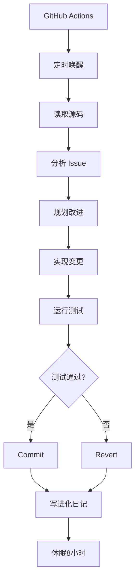

标题: 参数是 DNA，Harness 是身体｜Self-Evolving AI 活动回顾
来源: 微信公众号
抓取日期: 2026-04-17
链接: https://mp.weixin.qq.com/s/rN2p-3eQvVkyVN9_YQRn5A

内容长度: 6462 字符

# 完整内容

200 行 Rust 代码。一个不可变的目标：进化成能对标 Claude Code 的开源 coding agent。每 8 小时被 GitHub Actions 唤醒——读自己的源码、检查社区 Issue、规划改进、实现变更、跑测试。通过就 commit，失败就 revert，然后写日记，回去睡觉。
40 天后：42,000+ 行代码，1,700+ 测试，28 个模块，60+ slash commands。总花费约 300 美金。没有人类写过它的一行代码。
这个叫 Yoyo 的项目，是上周六在上海漕河泾一场闭门活动上展示的。当天聊的主题是"自进化 AI"——不是概念，是正在发生的事。台上的人有在做 RL 训练框架的，有在做分布式算力的，有在让模型自己跑实验的，有在用 AI 预测未来的。台下坐着投资人和创业者，聊到最后，没有人能给出"自进化 AI"的标准定义，但每个人都承认：这条路已经在走了。
活动由 Gradient、红杉中国、上海漕河泾开发区主办，AI Hackerhouse、真格基金、MiniMax、Unipat AI、Spark Labs 联合支持。
以下是当天的几个分享。

## 一、Yoyo 项目：一个自进化的 coding agent

**项目概况：**
- 起始：200 行 Rust 代码
- 目标：对标 Claude Code 的开源 coding agent
- 机制：每 8 小时 GitHub Actions 唤醒，自我改进
- 成果：42,000+ 行代码，1,700+ 测试，28 个模块，60+ slash commands
- 成本：约 300 美金
- 时间：40 天
- 特点：没有人类写过一行代码

**技术架构：**
1. **自我感知**：读取自己的源码
2. **需求分析**：检查社区 Issue
3. **规划改进**：制定改进计划
4. **实现变更**：自主编码实现
5. **测试验证**：运行测试套件
6. **版本控制**：通过 commit，失败 revert
7. **知识沉淀**：写日记记录

**进化机制：**
- **周期**：8 小时一个进化周期
- **目标驱动**：对标 Claude Code
- **反馈闭环**：测试驱动改进
- **成本可控**：300 美金 40 天
- **完全自主**：无人干预

## 二、自进化 AI 的核心理念

**三大核心要素：**
1. **参数是 DNA**：模型参数决定基础能力
2. **Harness 是身体**：框架支撑进化过程
3. **环境是选择压力**：Issue 和测试驱动进化

**进化路径：**
- **微观进化**：代码层面的自我改进
- **中观进化**：功能模块的自主扩展
- **宏观进化**：系统架构的自我优化

**技术突破：**
1. **自主编码**：模型自己写代码
2. **自我测试**：自主验证改进效果
3. **版本管理**：智能 commit/revert
4. **知识沉淀**：进化日记记录

## 三、技术实现路径

**架构设计：**

**关键技术：**
1. **Rust 语言**：内存安全，性能优越
2. **GitHub Actions**：自动化执行环境
3. **测试驱动**：确保改进质量
4. **版本控制**：可追溯的进化历史
5. **日志系统**：记录进化过程

**成本效益：**
- **人力成本**：0（完全自主）
- **计算成本**：300 美金/40天
- **时间成本**：8小时/周期
- **产出价值**：42,000+ 行高质量代码

## 四、自进化 AI 的应用场景

**1. 开源项目开发**
- 自主维护和改进
- 响应社区 Issue
- 持续功能扩展
- 质量自我保障

**2. 企业应用开发**
- 自动化代码生成
- 智能 bug 修复
- 性能自我优化
- 架构持续演进

**3. 研究领域探索**
- 自主实验设计
- 数据自我分析
- 假设自我验证
- 发现自我总结

**4. 教育领域应用**
- 个性化学习路径
- 智能答疑系统
- 内容自主生成
- 效果自我评估

## 五、面临的挑战

**技术挑战：**
1. **安全性**：自主代码的安全性保障
2. **可控性**：进化方向的正确性
3. **可解释性**：进化逻辑的透明性
4. **稳定性**：长期运行的可靠性

**伦理挑战：**
1. **责任归属**：自主行为的责任划分
2. **价值对齐**：进化目标的人类价值对齐
3. **权力边界**：自主决策的范围界定
4. **社会影响**：对就业和社会结构的影响

**治理挑战：**
1. **监管框架**：法律和政策框架
2. **标准制定**：技术标准和规范
3. **伦理准则**：行业自律准则
4. **国际合作**：全球治理协调

## 六、未来发展趋势

**短期趋势（1-2年）：**
1. **工具化**：自进化工具普及
2. **专业化**：垂直领域深度应用
3. **标准化**：技术标准和规范
4. **商业化**：商业应用探索

**中期趋势（3-5年）：**
1. **平台化**：自进化平台形成
2. **生态化**：应用生态繁荣
3. **智能化**：进化能力增强
4. **规模化**：大规模部署应用

**长期趋势（5-10年）：**
1. **通用化**：通用自进化 AI
2. **社会化**：融入社会生活
3. **全球化**：全球协作网络
4. **可持续化**：可持续发展模式

## 七、行业影响

**对开发者的影响：**
1. **角色转变**：从编码者到监督者
2. **技能升级**：需要新的技能组合
3. **效率提升**：开发效率大幅提升
4. **价值重塑**：工作价值重新定义

**对企业的影响：**
1. **成本结构**：人力成本大幅降低
2. **创新能力**：创新能力显著增强
3. **竞争优势**：技术优势重新洗牌
4. **商业模式**：商业模式创新

**对行业的影响：**
1. **技术格局**：技术格局重塑
2. **竞争态势**：竞争态势变化
3. **标准制定**：行业标准重定
4. **生态构建**：生态系统重建

---

**活动总结：**
自进化 AI 不再是一个概念，而是正在发生的技术革命。Yoyo 项目的成功展示证明了自进化 AI 的可行性，为 AI 发展开辟了新的路径。未来，自进化 AI 将深刻改变软件开发、企业运营、行业格局，甚至社会结构。我们需要积极拥抱这一变化，同时也要审慎应对挑战，确保技术发展符合人类价值和利益。