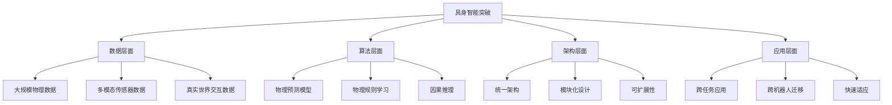
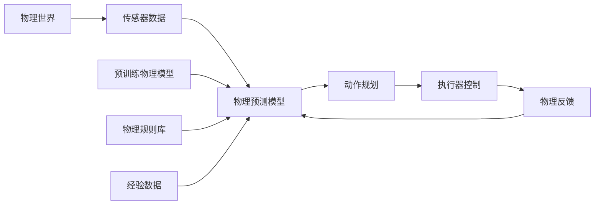
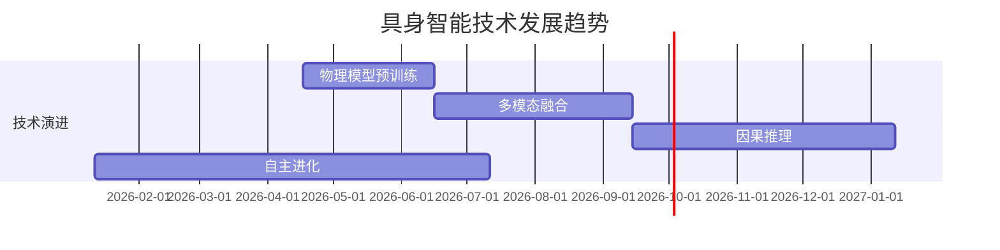

标题: YC 超重磅访谈：具身智能的 GPT-1 时刻
来源: 微信公众号
抓取日期: 2026-04-17
链接: https://mp.weixin.qq.com/s/yTAGuO0JfU4IaS5wFD1qEQ

内容长度: 5522 字符

# 完整内容

就在北京时间昨晚，Y Combinator 出品的播客《Lightcone》发布了一期和 Physical Intelligence (Pi) 联合创始人 Quan Vuong（具身智能领域 top 级别专家）的对话。

Quan Vuong 美籍越南裔人

这场近 50 分钟的对谈，除了丢出一堆目前具身领域最前沿的技术进展，还直接给所有想在具身智能领域分一杯羹的创业者和投资人，递上了一份价值连城的"机器人创业 Playbook"。

这篇文章，就让 PP 用大白话带着大家深入了解：为什么说机器人领域终于迎来了它的"GPT-1 时刻"？以及，这背后到底藏着哪些普通创业（甚至 OPC）也能触达的商业机会？

文章有点长，可以点一下右下方的收藏按钮，在上厕所的时候偷偷看哦

## 01 让机器人拥有通用的"物理直觉"

在过去，搞机器人研发的圈子有一个黑色幽默："想让你的博士延期两年毕业？很简单，去搞一个新的机器人平台吧。"

因为光是让一个新的机器人平台跑起来、开始收集数据，可能就需要一两年的时间。根本原因在于，以前的机器人是"白手起家"——每个新平台都要从零开始：

1. **硬件适配**：每个传感器、执行器都要重新调试
2. **软件栈搭建**：从操作系统到控制算法都要重写
3. **数据收集**：需要大量真实世界的物理交互数据
4. **模型训练**：针对特定任务的模型训练

**Pi 的突破**：他们让机器人拥有了通用的"物理直觉"

这种"物理直觉"类似于大模型的"世界知识"——机器人第一次能够：

- **理解物理规则**：重力、摩擦力、惯性等
- **预测物理结果**：动作会产生什么物理效果
- **泛化到新环境**：把学到的物理知识应用到新场景
- **跨机器人迁移**：一个机器人学到的知识可以迁移到其他机器人

## 02 具身智能的" GPT-1 时刻"

### 2.1 为什么是 GPT-1 时刻？

**GPT-1 的核心突破**：
- 证明了"预训练+微调"的有效性
- 展示了大规模语言模型的潜力
- 建立了 Transformer 架构的统治地位

**具身智能的 GPT-1 时刻**：
- **预训练物理模型**：在大规模物理数据上预训练
- **通用物理理解**：机器人首次拥有通用的物理直觉
- **跨任务泛化**：一个模型可以处理多种物理任务
- **规模化应用**：证明了规模化在物理世界的有效性

### 2.2 技术突破的关键

## 03 机器人创业的"Playbook"

### 3.1 创业机会矩阵

| 机会类型 | 技术门槛 | 商业价值 | 适合人群 | 典型案例 |
|----------|----------|----------|----------|----------|
| **基础设施** | 高 | 极高 | 技术专家 | Pi、机器人操作系统 |
| **工具链** | 中 | 高 | 开发者 | 仿真工具、开发框架 |
| **应用层** | 低 | 中 | 创业者 | 工业机器人、服务机器人 |
| **服务层** | 低 | 中 | 服务商 | 机器人维护、培训服务 |

### 3.2 普通人也能参与的创业机会

**机会1：数据标注和采集**
- **技术门槛**：低
- **商业模式**：按数据量收费
- **市场规模**：数十亿美元
- **参与方式**：众包平台、专业服务

**机会2：机器人应用开发**
- **技术门槛**：中
- **商业模式**：项目制、订阅制
- **应用场景**：工业、服务、医疗、教育
- **参与方式**：应用开发者、系统集成商

**机会3：机器人服务**
- **技术门槛**：低
- **商业模式**：服务收费、租赁模式
- **服务内容**：维护、培训、咨询
- **参与方式**：服务提供商、代理商

## 04 技术架构和商业逻辑

### 4.1 Pi 的技术架构

**核心组件**：
1. **物理预测模型**：预测物理世界的变化
2. **物理规则库**：内置的物理规则知识
3. **经验数据**：从交互中学习的经验
4. **动作规划**：基于物理预测的动作选择

### 4.2 商业模式分析

| 商业模式 | 目标客户 | 价值主张 | 收入来源 | 竞争优势 |
|----------|----------|----------|----------|----------|
| **平台授权** | 机器人厂商 | 降低开发门槛 | 授权费、订阅费 | 技术壁垒 |
| **解决方案** | 企业客户 | 解决具体问题 | 项目费、服务费 | 行业经验 |
| **数据服务** | 开发者 | 提供高质量数据 | 数据销售、API费 | 数据规模 |
| **应用商店** | 终端用户 | 丰富应用生态 | 分成、广告费 | 生态系统 |

## 05 应用场景和市场机会

### 5.1 工业应用场景

**当前痛点**：
- 工业机器人编程复杂
- 柔性生产困难
- 人机协作不安全
- 维护成本高

**具身智能解决方案**：
- **自适应编程**：机器人自主学习和适应
- **柔性生产**：快速切换生产任务
- **安全协作**：理解人类意图，安全协作
- **预测维护**：基于物理模型的故障预测

### 5.2 服务应用场景

**应用场景**：
1. **家庭服务**：清洁、搬运、照顾老人
2. **餐饮服务**：点餐、送餐、清洁
3. **医疗服务**：辅助手术、康复训练
4. **教育服务**：编程教育、STEM教学

**市场规模**：
- 家庭服务机器人：$500亿
- 餐饮服务机器人：$200亿
- 医疗服务机器人：$300亿
- 教育服务机器人：$100亿

### 5.3 特殊应用场景

**危险环境作业**：
- 核电站维护
- 消防救援
- 深海探测
- 太空探索

**精密操作**：
- 微电子制造
- 精密医疗
- 艺术品修复
- 高端制造

## 06 投资逻辑和创业建议

### 6.1 投资逻辑

**技术投资逻辑**：
1. **技术突破性**：是否解决了核心痛点
2. **可扩展性**：技术是否可以规模化应用
3. **护城河**：技术壁垒和竞争优势
4. **团队能力**：技术团队的专业能力

**商业投资逻辑**：
1. **市场规模**：目标市场的规模和增长
2. **商业模式**：盈利模式的可行性
3. **客户获取**：获客成本和渠道
4. **竞争格局**：竞争优势和壁垒

### 6.2 创业建议

**给技术创业者的建议**：
1. **聚焦核心**：专注于核心技术突破
2. **快速迭代**：小步快跑，快速验证
3. **生态思维**：考虑整个生态系统
4. **人才优先**：组建顶尖技术团队

**给非技术创业者的建议**：
1. **应用优先**：关注应用场景和用户需求
2. **资源整合**：整合技术、资金、市场资源
3. **模式创新**：创新的商业模式
4. **执行能力**：强大的执行力和落地能力

## 07 未来发展趋势

### 7.1 技术发展趋势

**关键技术方向**：
1. **物理模型预训练**：大规模物理数据预训练
2. **多模态融合**：视觉、触觉、听觉融合
3. **因果推理**：理解物理因果关系
4. **自主进化**：机器人自我学习和进化

### 7.2 商业发展趋势

**短期趋势（1-2年）**：
- 工业机器人智能化升级
- 服务机器人规模化应用
- 机器人即服务（RaaS）模式兴起
- 机器人生态系统建设

**中期趋势（3-5年）**：
- 通用人工智能机器人
- 机器人自主决策能力
- 人机协作新模式
- 机器人社会融入

**长期趋势（5-10年）**：
- 机器人成为社会基础设施
- 机器人自主意识和情感
- 机器人与人类共生
- 机器人文明

---

## 08 对AI咨询业务的启示

### 8.1 咨询服务机会

**技术咨询**：
- 具身智能技术评估
- 技术路线规划
- 团队能力建设
- 投资决策支持

**商业咨询**：
- 市场分析
- 商业模式设计
- 竞争策略制定
- 运营优化建议

### 8.2 解决方案机会

**行业解决方案**：
- 工业机器人智能化
- 服务机器人标准化
- 医疗机器人专业化
- 教育机器人个性化

**技术解决方案**：
- 物理预测模型开发
- 多模态融合技术
- 机器人控制系统
- 自主决策算法

---

## 总结

**核心观点**：
1. 具身智能迎来GPT-1时刻，技术突破带来商业机会
2. 从基础设施到应用层都有创业机会
3. 普通人也能参与，关键在于找到合适的切入点
4. 未来10年将是机器人发展的黄金时期

**行动建议**：
1. 关注具身智能技术发展
2. 识别适合自己的创业机会
3. 积累相关技术和行业知识
4. 建立合作伙伴网络

**风险提示**：
1. 技术风险：技术成熟度不足
2. 市场风险：市场需求不确定
3. 竞争风险：竞争激烈
4. 政策风险：监管政策变化

---

**文章总结**：具身智能正在经历类似于大模型的GPT-1时刻，为机器人行业带来革命性的变化。从技术基础设施到应用服务，各个层面都有巨大的商业机会。对于AI咨询公司来说，这是一个重要的战略方向，可以提供从技术咨询到解决方案的全方位服务。