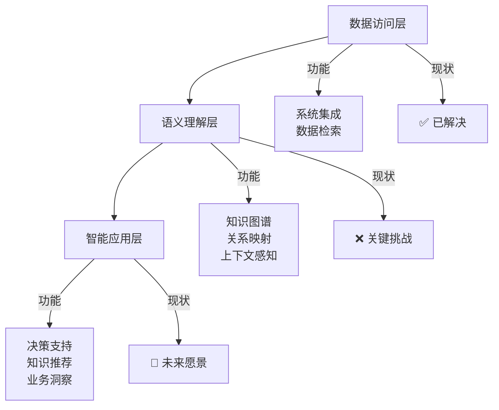

# 第二大脑架构建设指南

## 核心理念

### 从数据收集到知识理解
基于最新行业洞察（Hyperspell Conor Brennan-Burke），AI发展分为两个关键阶段：

**第一阶段：访问(Access) - 已解决**
- ✅ AI可以连接各种企业系统（Slack、Google Drive、CRM、Notion、邮件）
- ✅ AI可以搜索、读取、查询数据
- ✅ 2025年已基本实现

**第二阶段：理解(Understanding) - 待解决**
- ❌ AI不理解组织架构、决策流程、真实沟通渠道
- ❌ AI无法区分正式流程vs实际运作，表面信息vs真实意图
- ❌ 2026年核心挑战

### 三层架构模型



## 第二大脑建设原则

### 1. 关联重于收集
**错误做法**:
- 大量收集文章、笔记、文档
- 缺乏有效的组织和关联
- 信息孤岛，无法形成知识网络

**正确做法**:
- 每添加一条信息，都要思考它与现有知识的关联
- 建立跨文档、跨主题的知识连接
- 构建动态演化的知识图谱

### 2. 上下文是关键
**核心要素**:
- **来源信息**: 谁写的、什么时候、什么背景
- **关系网络**: 与其他概念、人物、项目的关联
- **演变历史**: 观点的发展、修正、更新过程
- **应用场景**: 在什么情况下有用，如何使用

### 3. 动态知识体系
**特征**:
- 知识不是静态的，而是随着时间演化
- 新的洞察会修正或补充旧的知识
- 需要定期回顾和更新知识连接
- 反映真实的组织运作和最佳实践

## 实际应用指南

### 新信息处理流程

```python
# 信息处理四步法
def process_new_information(content):
    # 第一步：提取核心洞察
    key_insights = extract_insights(content)
    
    # 第二步：建立关联
    connections = find_connections(key_insights, existing_knowledge)
    
    # 第三步：构建上下文
    context = build_context(content, connections)
    
    # 第四步：整合应用
    integrate_and_apply(key_insights, context, connections)
```

### 具体操作步骤

**第一步：信息收集 (RAW层)**
- 保存原始内容（文章、笔记、文档）
- 记录来源、时间、作者信息
- 提取关键观点和数据

**第二步：关联建立 (WIKI层)**
- 识别核心概念和实体
- 建立概念间的关系网络
- 创建知识框架和方法论

**第三步：应用输出 (OUTPUTS层)**
- 基于知识库生成洞察和建议
- 创建可执行的行动计划
- 转化为商业价值

## 质量控制机制

### 自我检查清单
- [ ] 这条信息与已有知识有什么关联？
- [ ] 它的上下文是什么？（来源、时间、背景）
- [ ] 如何验证其准确性和时效性？
- [ ] 在什么场景下可以使用？
- [ ] 与其他观点有什么异同？

### 持续改进机制
- **定期回顾**: 每周检查知识库的新连接
- **效果验证**: 跟踪知识应用的实际效果
- **更新维护**: 修正过时的信息，补充新的洞察
- **经验沉淀**: 将有效的方法标准化并纳入流程

## 与AI咨询业务的结合

### 核心价值主张
1. **知识管理专业化**: 帮助企业建立第二大脑，实现知识资产化
2. **AI理解层建设**: 在数据访问基础上构建语义理解能力
3. **组织智能提升**: 让AI真正理解企业运作，提供深度洞察
4. **持续学习机制**: 建立自学习的组织知识体系

### 服务产品化路径
1. **评估诊断**: 评估企业知识管理成熟度和AI理解需求
2. **架构设计**: 设计三层架构的第二大脑解决方案
3. **实施建设**: 构建知识图谱和语义理解层
4. **培训赋能**: 培训团队使用和维护第二大脑系统

## 今日行动清单

### 立即行动 (本周)
- [ ] 应用新的知识处理流程到日常工作中
- [ ] 检查现有知识库的关联完整性
- [ ] 更新知识库架构文档

### 短期目标 (本月)
- [ ] 建立至少10个新的知识连接
- [ ] 完善3个核心知识框架
- [ ] 验证知识应用效果

### 中期规划 (本季度)
- [ ] 完成第二大脑基础架构建设
- [ ] 开发知识管理培训材料
- [ ] 将知识库转化为AI咨询服务产品

---

**文档创建**: 2026年4月20日  
**最后更新**: 2026年4月20日  
**相关文件**: 
- wiki/ai-understanding-vs-access-framework.md
- wiki/knowledge-management-framework.md
- raw/wechat_工具接了几几十个，AI还是搞不懂你的公司_20260420.md