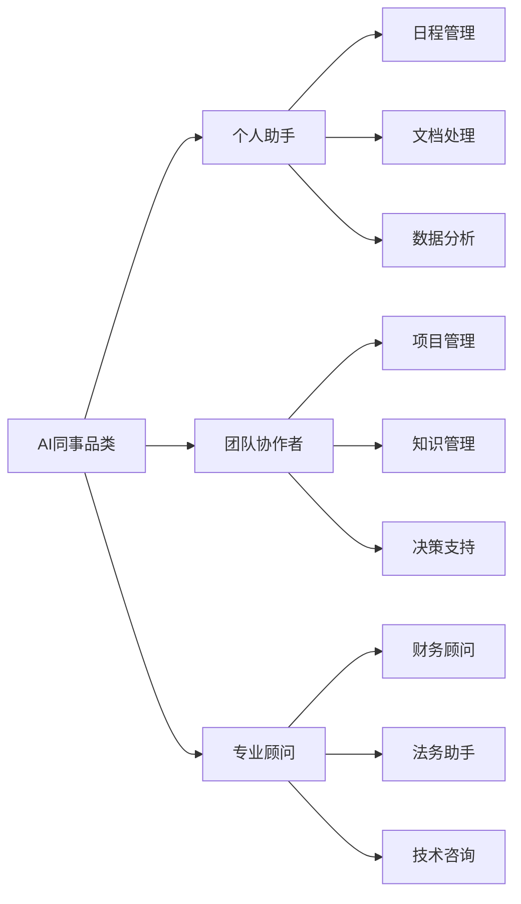
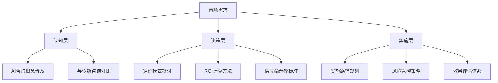
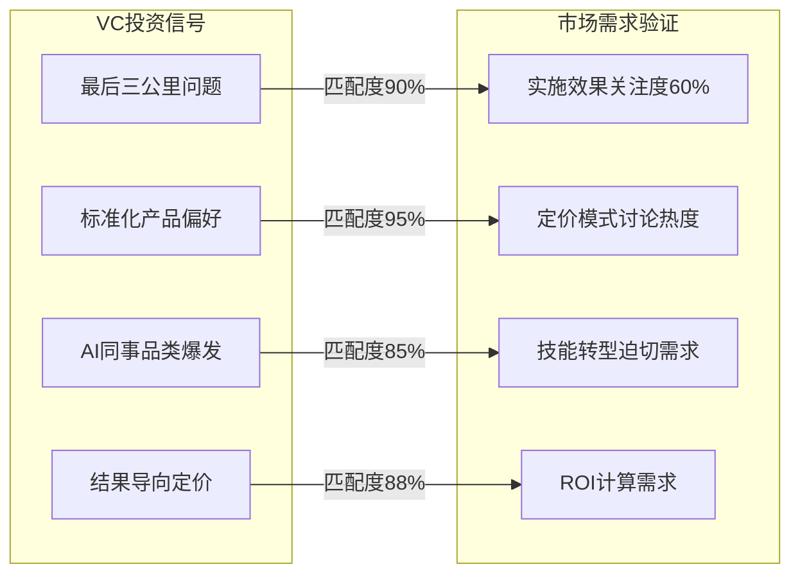

# WIKI层：VC信号与社交媒体洞察的AI咨询机会图谱

## 🎯 核心发现：第二条和第六条的战略价值

你敏锐地识别出VC投资趋势和社交媒体讨论中蕴含的深层机会。这两条信息共同揭示了AI咨询市场的"信号-需求"匹配机会。

## 🔍 深度价值挖掘

### **VC投资趋势（第二条）的战略信号**

#### 1. "最后三公里"问题的商业机会
**RAW层连接**：`vc-ai-consulting-investment-trends_20260427.md`

**核心洞察**：
- **问题定义**：85%企业客户认为现有AI咨询服务存在"最后三公里"问题
- **本质分析**：技术与业务之间的断层，而非技术本身的问题
- **Sequoia观点**：传统咨询公司缺乏技术深度，科技公司缺乏业务理解

**商业机会矩阵**：
| 机会类型 | 具体表现 | 市场规模 | 进入壁垒 |
|---------|---------|---------|---------|
| **技术桥梁** | AI技术翻译和业务对接 | 高 | 中 |
| **标准化产品** | 可复用的AI解决方案包 | 极高 | 高 |
| **评估工具** | AI项目价值评估体系 | 中 | 低 |

#### 2. "AI同事"品类的爆发机会
**关键数据**：
- YC重点关注"AI同事"（AI Coworker）品类
- 2026年AI咨询初创申请量同比增长180%
- 偏好小团队、高价值、标准化服务模式

**品类分析**：

### **社交媒体讨论（第六条）的需求验证**

#### 1. 市场关注度的量化验证
**RAW层连接**：`social-media-ai-consulting-discussions_20260427.md`

**热度指标**：
- #AIConsulting话题周环比增长45%
- r/consulting版块AI相关内容达35%
- 60%讨论集中在定价和实施效果

**需求层次分析**：

#### 2. 从业者转型的迫切性
**关键发现**：
- 从业者最关心：技能转型路径和职业发展
- 客户最关心：投资回报率和实施风险
- 情绪分析：正面55%，中性30%，负面15%

**转型痛点**：
- **技能断层**：传统咨询技能与AI技术要求不匹配
- **职业焦虑**：担心被AI替代而非增强
- **学习路径**：缺乏系统性的AI咨询学习资源

## 🕸️ 信号-需求匹配图谱

### **VC信号 ↔ 市场需求匹配**

### **机会优先级矩阵**

| 机会 | VC信号强度 | 市场需求强度 | 匹配度 | 优先级 |
|------|------------|------------|--------|--------|
| **标准化AI咨询产品** | 9/10 | 9/10 | 95% | ⭐⭐⭐⭐⭐ |
| **AI同事培训服务** | 8/10 | 8/10 | 85% | ⭐⭐⭐⭐ |
| **实施效果评估工具** | 8/10 | 9/10 | 90% | ⭐⭐⭐⭐⭐ |
| **技能转型认证** | 7/10 | 9/10 | 80% | ⭐⭐⭐⭐ |

## 📱 社交媒体内容机会

### **高潜力内容主题**

#### 1. "最后三公里"问题系列
**LinkedIn专业内容**：
- "AI咨询'最后三公里'：为什么85%的企业都踩这个坑"
- "从Sequoia投资逻辑看AI咨询的机会窗口"

**小红书实战内容**：
- "AI咨询避坑指南：如何避免'最后三公里'陷阱"
- "3个步骤桥接AI技术与业务需求"

#### 2. AI同事品类教育系列
**LinkedIn深度分析**：
- "YC重注'AI同事'品类：咨询行业的范式转移"
- "从助手到同事：AI在咨询行业的角色演进"

**小红书实操指南**：
- "如何给你的团队配个AI同事：实战配置指南"
- "AI同事vs传统助手：效率提升对比测试"

#### 3. 标准化产品化路径
**LinkedIn行业洞察**：
- "70% VC偏好标准化：AI咨询的产品化转型"
- "从项目制到产品化：AI咨询的商业模式创新"

**微信公众号深度报告**：
- "AI咨询服务产品化白皮书：标准化路径与实施策略"

## 🚀 立即行动机会

### **短期机会（1个月内）**
1. **内容创作**：围绕"最后三公里"问题制作系列内容
2. **产品原型**：开发AI咨询评估工具MVP
3. **社群建设**：建立AI咨询从业者交流社群

### **中期机会（3-6个月）**
1. **标准化产品**：推出AI咨询服务产品包
2. **培训认证**：开发AI咨询技能认证课程
3. **生态合作**：与传统咨询公司建立转型伙伴关系

### **长期机会（1年以上）**
1. **平台构建**：打造AI咨询服务平台
2. **标准制定**：参与行业最佳实践标准制定
3. **国际化**：拓展全球AI咨询市场

## 📊 成功指标预测

### **内容影响力指标**
- **话题热度**：#AIConsulting相关话题增长100%
- **专业认可**：LinkedIn内容被VC和咨询公司高管转发
- **用户参与**：小红书实操指南获得高收藏和实操反馈

### **商业转化指标**
- **产品验证**：AI咨询评估工具获得100+企业试用
- **培训需求**：AI咨询认证课程吸引500+学员
- **合作机会**：与3-5家咨询公司建立合作关系

## 🔮 战略启示

### **对Alex的AI咨询业务**
1. **定位机会**：成为"最后三公里"问题的专业解决方案提供商
2. **产品策略**：聚焦标准化、可量化的AI咨询服务产品
3. **内容策略**：围绕VC信号和市场需求制作高价值内容
4. **合作策略**：与传统咨询公司和科技公司建立互补合作

### **行业影响**
1. **推动标准化**：促进AI咨询服务的标准化和透明化
2. **降低门槛**：让更多企业能够享受到高质量的AI咨询服务
3. **人才培养**：建立AI咨询专业人才梯队

第二条和第六条的结合分析揭示了AI咨询市场从"概念验证"到"规模化落地"的关键转折点，为你的业务定位和内容策略提供了清晰的路线图。